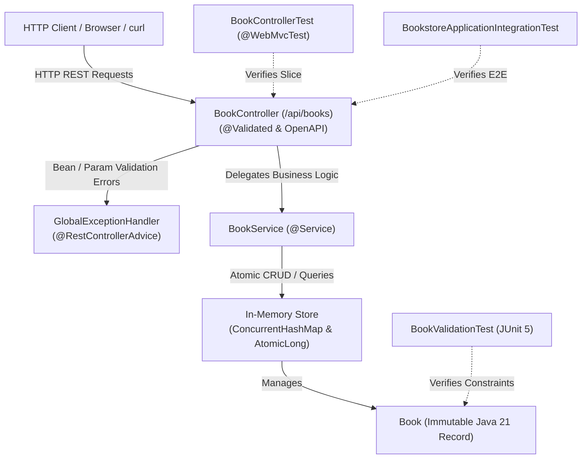

# Bookstore API — Architecture & Component Analysis

## Overview

The **Bookstore API** is a modern Spring Boot application built with Java 21 and Spring Boot 3.5.7, designed around a layered REST architecture. The application uses an in-memory data store with thread-safe data structures, defensive arithmetic limits, and Java 21 immutable records.

---

## Key Components

### 1. Application Entry Point
* **File:** [`BookstoreApplication.java`](file:///Users/kennethkousen/Documents/OReilly/antigravity-training/exercises/java/bookstore-api/src/main/java/com/example/bookstore/BookstoreApplication.java#L10-L16)
* **Class:** [`BookstoreApplication`](file:///Users/kennethkousen/Documents/OReilly/antigravity-training/exercises/java/bookstore-api/src/main/java/com/example/bookstore/BookstoreApplication.java#L10-L16)
* **Role:** Standard Spring Boot bootstrap class marked with `@SpringBootApplication` that starts the Spring ApplicationContext and embedded Tomcat server.

---

### 2. Presentation Layer (REST Controllers & Error Handling)
* **File:** [`BookController.java`](file:///Users/kennethkousen/Documents/OReilly/antigravity-training/exercises/java/bookstore-api/src/main/java/com/example/bookstore/controller/BookController.java#L21-L125)
  * **Class:** [`BookController`](file:///Users/kennethkousen/Documents/OReilly/antigravity-training/exercises/java/bookstore-api/src/main/java/com/example/bookstore/controller/BookController.java#L21-L125)
  * **Base Path:** `/api/books`
  * **Role:** Exposes RESTful HTTP endpoints for managing books. Annotated with `@Validated` and OpenAPI 3 annotations. Uses constructor-based dependency injection to inject [`BookService`](file:///Users/kennethkousen/Documents/OReilly/antigravity-training/exercises/java/bookstore-api/src/main/java/com/example/bookstore/service/BookService.java#L15-L124).
  * **Supported Operations:**
    * `GET /api/books`: Retrieve all books with optional validated pagination (`page >= 0`, `1 <= size <= 100`) and sorting (`sortBy`).
    * `GET /api/books/{id}`: Retrieve a specific book by validated positive ID (returns `200 OK` or `404 Not Found`).
    * `GET /api/books/search?q={query}`: Search books by non-blank title substring.
    * `GET /api/books/author/{author}`: Filter books by author name.
    * `GET /api/books/genre/{genre}`: Filter books by genre name.
    * `GET /api/books/in-stock`: Filter books currently in stock (`stock > 0`).
    * `POST /api/books`: Create a new book with `@Valid` request body (returns `201 Created` with `Location` header).
    * `PUT /api/books/{id}`: Update an existing book with positive ID and `@Valid` request body.
    * `DELETE /api/books/{id}`: Remove a book by positive ID (returns `204 No Content` or `404 Not Found`).

* **File:** [`GlobalExceptionHandler.java`](file:///Users/kennethkousen/Documents/OReilly/antigravity-training/exercises/java/bookstore-api/src/main/java/com/example/bookstore/controller/GlobalExceptionHandler.java#L15-L78)
  * **Class:** [`GlobalExceptionHandler`](file:///Users/kennethkousen/Documents/OReilly/antigravity-training/exercises/java/bookstore-api/src/main/java/com/example/bookstore/controller/GlobalExceptionHandler.java#L15-L78)
  * **Role:** Centralized exception handler marked with `@RestControllerAdvice`. Catches and structures error maps for:
    * `MethodArgumentNotValidException` (Request body validation failures)
    * `HandlerMethodValidationException` / `ConstraintViolationException` (Query & path parameter violations)
    * `MethodArgumentTypeMismatchException` (Non-numeric path variables)
    * `MissingServletRequestParameterException` (Missing required parameters)
    * `HttpMessageNotReadableException` (Malformed JSON bodies)
    * `IllegalStateException` / `IllegalArgumentException`

---

### 3. Business & Persistence Layer
* **File:** [`BookService.java`](file:///Users/kennethkousen/Documents/OReilly/antigravity-training/exercises/java/bookstore-api/src/main/java/com/example/bookstore/service/BookService.java#L15-L124)
* **Class:** [`BookService`](file:///Users/kennethkousen/Documents/OReilly/antigravity-training/exercises/java/bookstore-api/src/main/java/com/example/bookstore/service/BookService.java#L15-L124)
* **Role:**
  * Contains business logic and acts as an in-memory data repository.
  * Uses `ConcurrentHashMap<Long, Book>` for thread-safe storage and `AtomicLong` for unique identifier generation.
  * Enforces a catalog capacity limit of `MAX_CAPACITY = 10,000` to prevent unbounded memory growth.
  * Uses defensive 64-bit integer arithmetic in pagination to prevent multiplication overflow.
  * Uses `ConcurrentHashMap.computeIfPresent(...)` for thread-safe atomic entity replacement.
  * Returns unmodifiable defensive copies (`List.copyOf()`).

---

### 4. Domain & Data Model
* **File:** [`Book.java`](file:///Users/kennethkousen/Documents/OReilly/antigravity-training/exercises/java/bookstore-api/src/main/java/com/example/bookstore/model/Book.java#L14-L62)
* **Type:** `public record Book(...)` (Immutable Java 21 Record)
* **Role:** Immutable domain model and transfer record.
* **Fields & Constraints:**
  * `id` (`Long`): Identifier (auto-generated).
  * `title` (`String`): `@NotBlank`, `@Size(max = 255)`
  * `author` (`String`): `@NotBlank`, `@Size(max = 255)`
  * `isbn` (`String`): `@NotBlank`, `@Size(max = 20)`
  * `price` (`BigDecimal`): `@NotNull`, `@DecimalMin("0.0")`, `@Digits(integer = 8, fraction = 2)`
  * `publishedDate` (`LocalDate`): `@PastOrPresent`
  * `genre` (`String`): `@NotBlank`, `@Size(max = 100)`
  * `stock` (`int`): `@Min(0)`
  * `isInStock()`: Derived helper method (`stock > 0`).

---

### 5. Testing Layer (56 Automated Tests)
* **Integration Tests:** [`BookstoreApplicationIntegrationTest.java`](file:///Users/kennethkousen/Documents/OReilly/antigravity-training/exercises/java/bookstore-api/src/test/java/com/example/bookstore/BookstoreApplicationIntegrationTest.java) (3 `@SpringBootTest` tests on random port).
* **Controller Slice Tests:** [`BookControllerTest.java`](file:///Users/kennethkousen/Documents/OReilly/antigravity-training/exercises/java/bookstore-api/src/test/java/com/example/bookstore/controller/BookControllerTest.java) (20 `@WebMvcTest` tests with MockMvc and `@MockitoBean`).
* **Validation Unit Tests:** [`BookValidationTest.java`](file:///Users/kennethkousen/Documents/OReilly/antigravity-training/exercises/java/bookstore-api/src/test/java/com/example/bookstore/model/BookValidationTest.java) (7 standalone Jakarta validator tests).
* **Service Unit Tests:** [`BookServiceTest.java`](file:///Users/kennethkousen/Documents/OReilly/antigravity-training/exercises/java/bookstore-api/src/test/java/com/example/bookstore/service/BookServiceTest.java) (26 JUnit 5 + AssertJ tests).
