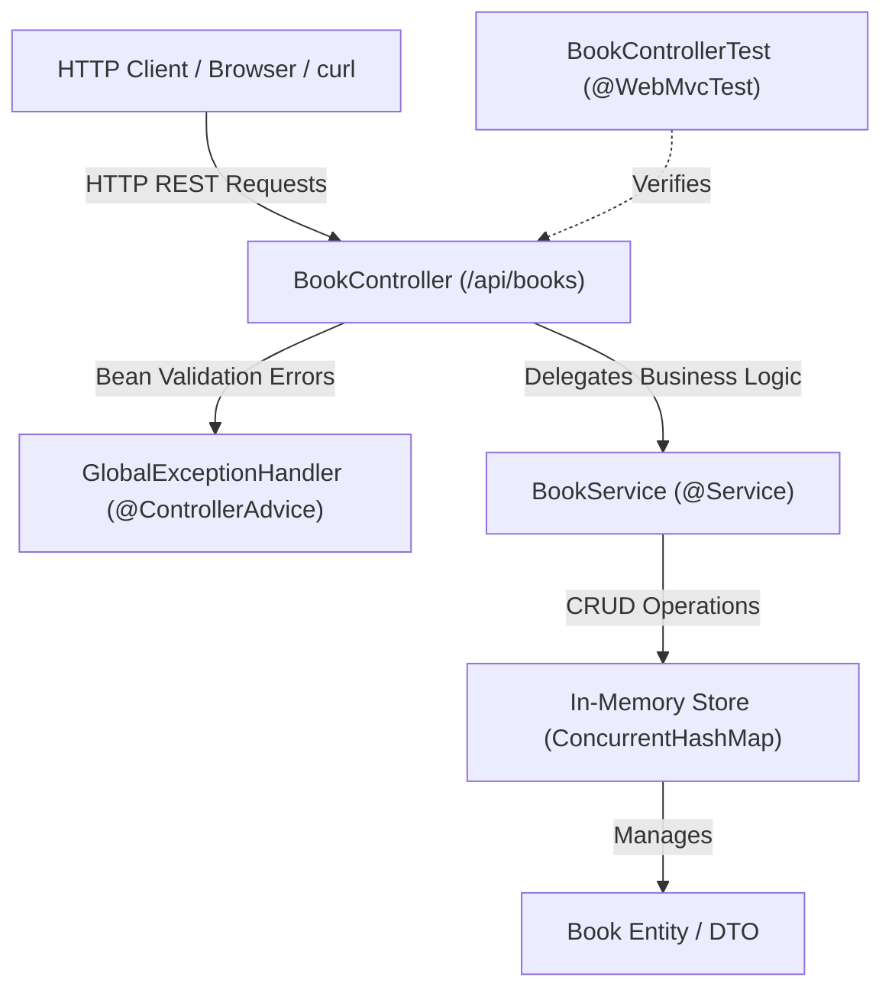

# Bookstore API — Architecture & Component Analysis

## Overview

The **Bookstore API** is a Spring Boot application built with Java 21, designed around a layered REST architecture. The application currently uses an in-memory data store with thread-safe data structures for fast prototyping and testing.

---

## Key Components

### 1. Application Entry Point
* **File:** [`BookstoreApplication.java`](file:///Users/kennethkousen/Documents/OReilly/antigravity-training/exercises/java/bookstore-api/src/main/java/com/example/bookstore/BookstoreApplication.java#L10-L16)
* **Class:** [`BookstoreApplication`](file:///Users/kennethkousen/Documents/OReilly/antigravity-training/exercises/java/bookstore-api/src/main/java/com/example/bookstore/BookstoreApplication.java#L10-L16)
* **Role:** Standard Spring Boot bootstrap class marked with `@SpringBootApplication` that starts the Spring ApplicationContext and embedded Tomcat server.

---

### 2. Presentation Layer (REST Controllers & Error Handling)
* **File:** [`BookController.java`](file:///Users/kennethkousen/Documents/OReilly/antigravity-training/exercises/java/bookstore-api/src/main/java/com/example/bookstore/controller/BookController.java#L15-L83)
  * **Class:** [`BookController`](file:///Users/kennethkousen/Documents/OReilly/antigravity-training/exercises/java/bookstore-api/src/main/java/com/example/bookstore/controller/BookController.java#L15-L83)
  * **Base Path:** `/api/books`
  * **Role:** Exposes RESTful HTTP endpoints for managing books. Uses constructor-based dependency injection to inject [`BookService`](file:///Users/kennethkousen/Documents/OReilly/antigravity-training/exercises/java/bookstore-api/src/main/java/com/example/bookstore/service/BookService.java#L16-L126).
  * **Supported Operations:**
    * `GET /api/books`: Retrieve all books with optional pagination (`page`, `size`) and sorting (`sortBy`).
    * `GET /api/books/{id}`: Retrieve a specific book by ID (returns `200 OK` or `404 Not Found`).
    * `GET /api/books/search?q={query}`: Search books by title substring.
    * `GET /api/books/author/{author}`: Filter books by author.
    * `GET /api/books/genre/{genre}`: Filter books by genre.
    * `GET /api/books/in-stock`: Filter books currently in stock (`stock > 0`).
    * `POST /api/books`: Create a new book with `@Valid` request body (returns `201 Created`).
    * `PUT /api/books/{id}`: Update an existing book with `@Valid` request body.
    * `DELETE /api/books/{id}`: Remove a book by ID (returns `204 No Content` or `404 Not Found`).

* **File:** [`GlobalExceptionHandler.java`](file:///Users/kennethkousen/Documents/OReilly/antigravity-training/exercises/java/bookstore-api/src/main/java/com/example/bookstore/controller/GlobalExceptionHandler.java#L12-L24)
  * **Class:** [`GlobalExceptionHandler`](file:///Users/kennethkousen/Documents/OReilly/antigravity-training/exercises/java/bookstore-api/src/main/java/com/example/bookstore/controller/GlobalExceptionHandler.java#L12-L24)
  * **Role:** Centralized exception handler marked with `@ControllerAdvice`. Catches `MethodArgumentNotValidException` generated during request validation and transforms validation field errors into structured JSON key-value response maps with HTTP 400 status.

---

### 3. Business & Persistence Layer
* **File:** [`BookService.java`](file:///Users/kennethkousen/Documents/OReilly/antigravity-training/exercises/java/bookstore-api/src/main/java/com/example/bookstore/service/BookService.java#L16-L126)
* **Class:** [`BookService`](file:///Users/kennethkousen/Documents/OReilly/antigravity-training/exercises/java/bookstore-api/src/main/java/com/example/bookstore/service/BookService.java#L16-L126)
* **Role:**
  * Contains business logic and acts as an in-memory data repository.
  * Uses `ConcurrentHashMap<Long, Book>` for thread-safe storage and `AtomicLong` for unique identifier generation.
  * Pre-populates sample catalog data in its constructor.
  * Handles in-memory sorting, pagination calculations, filtering via Java Streams, and entity updates.

---

### 4. Domain & Data Model
* **File:** [`Book.java`](file:///Users/kennethkousen/Documents/OReilly/antigravity-training/exercises/java/bookstore-api/src/main/java/com/example/bookstore/model/Book.java#L14-L81)
* **Class:** [`Book`](file:///Users/kennethkousen/Documents/OReilly/antigravity-training/exercises/java/bookstore-api/src/main/java/com/example/bookstore/model/Book.java#L14-L81)
* **Role:** Represents the Book entity and request/response transfer object.
* **Fields & Constraints:**
  * `id` (`Long`): Identifier.
  * `title` (`String`): `@NotBlank(message = "Title cannot be blank")`
  * `author` (`String`): `@NotBlank(message = "Author cannot be blank")`
  * `isbn` (`String`): `@NotBlank(message = "ISBN cannot be blank")`
  * `price` (`BigDecimal`): `@NotNull`, `@Min(0)`
  * `publishedDate` (`LocalDate`): `@PastOrPresent`
  * `genre` (`String`): `@NotBlank(message = "Genre cannot be blank")`
  * `stock` (`int`): `@Min(0)`
  * `isInStock()`: Helper method checking if `stock > 0`.

---

### 5. Testing Layer
* **File:** [`BookControllerTest.java`](file:///Users/kennethkousen/Documents/OReilly/antigravity-training/exercises/java/bookstore-api/src/test/java/com/example/bookstore/controller/BookControllerTest.java#L27-L183)
* **Class:** [`BookControllerTest`](file:///Users/kennethkousen/Documents/OReilly/antigravity-training/exercises/java/bookstore-api/src/test/java/com/example/bookstore/controller/BookControllerTest.java#L27-L183)
* **Role:** Web layer slice test using `@WebMvcTest(BookController.class)`, `MockMvc`, and `@MockitoBean BookService`.
* **Coverage:**
  * Endpoint routing and HTTP status codes (`200`, `201`, `204`, `400`, `404`).
  * Request validation failure scenarios and formatted error responses.
  * Pagination query parameters.
