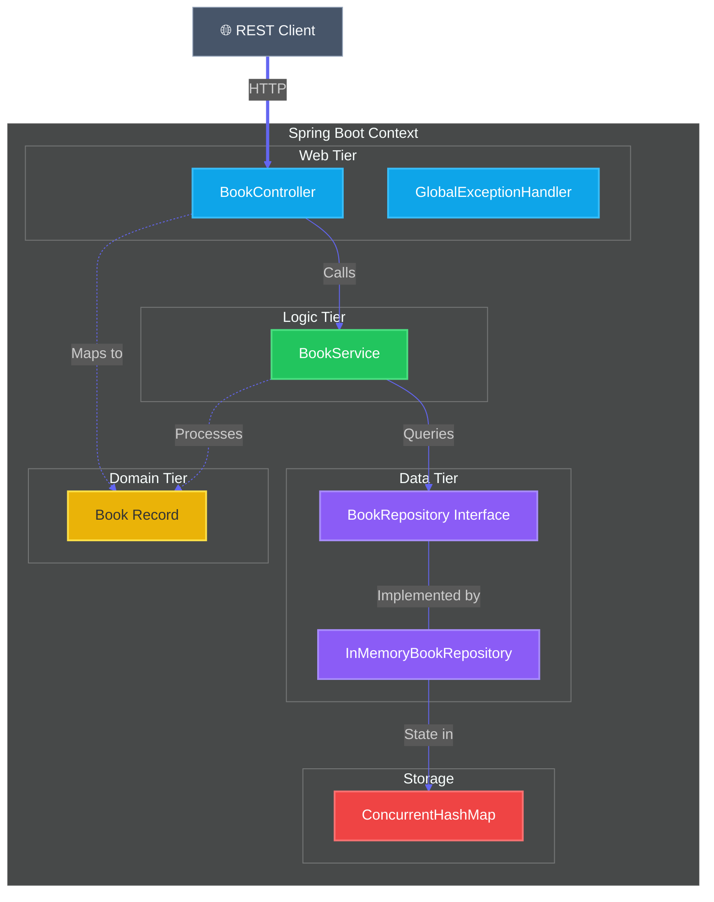
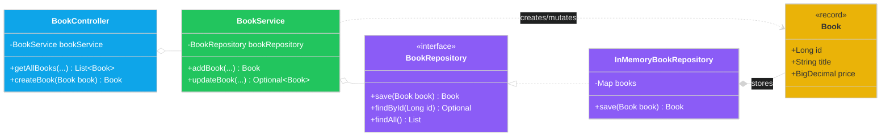

# Project Architecture: Bookstore API

This document provides a comprehensive technical overview of the Bookstore API's architecture, following its refactor to support **Immutability** and the **Repository Pattern**.

## 🏛️ Architectural Style
The project implements a **Four-Tier Layered Architecture** (Controller -> Service -> Repository -> Model). This structure aligns with modern Spring Boot best practices and team standards for clean code and separation of concerns.

### 1. Presentation Layer (REST API)
*   **BookController**: Handles HTTP request mapping and coordinates with the service layer. It consumes and produces immutable `Book` records.
*   **GlobalExceptionHandler**: Provides centralized error management using Spring's `@ControllerAdvice` and `@ExceptionHandler`.

### 2. Business Logic Layer
*   **BookService**: Contains core domain logic. It is decoupled from data storage, focusing on business rules like search filtering and pagination.

### 3. Data Access Layer (Persistence)
*   **BookRepository (Interface)**: Defines the contract for all data operations.
*   **InMemoryBookRepository**: A thread-safe implementation that manages the in-memory state using `ConcurrentHashMap`. This allows for easy migration to a persistent DB (like PostgreSQL) by simply swapping implementations.

### 4. Domain Layer
*   **Book (Record)**: A Java `record` providing a truly immutable data model. It includes JSR-380 validation to ensure data integrity at the system boundaries.

---

## 🗺️ System Visualization

### 1. Architectural Component Map
This diagram illustrates the flow of a request through the refactored layers.

### 2. Detailed Class Schema (Post-Refactor)
Static relationships emphasizing the dependency inversion through the Repository interface.

---

## 🛠️ Design Patterns Applied
*   **Dependency Inversion**: The Service depends on the `BookRepository` interface, not the concrete implementation.
*   **Immutability**: The `Book` record ensures that data cannot be modified accidentally after creation. Updates are handled by creating new record instances.
*   **Concurrency**: Thread safety is guaranteed at the repository level via `ConcurrentHashMap` and `AtomicLong`.
*   **AOP Error Handling**: `GlobalExceptionHandler` ensures that business logic doesn't need to worry about formatting error responses.
