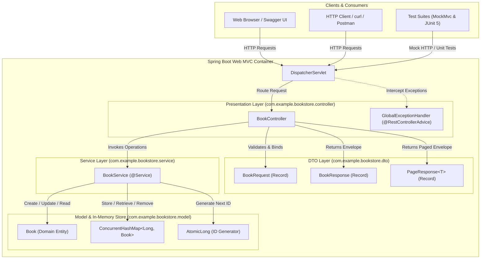
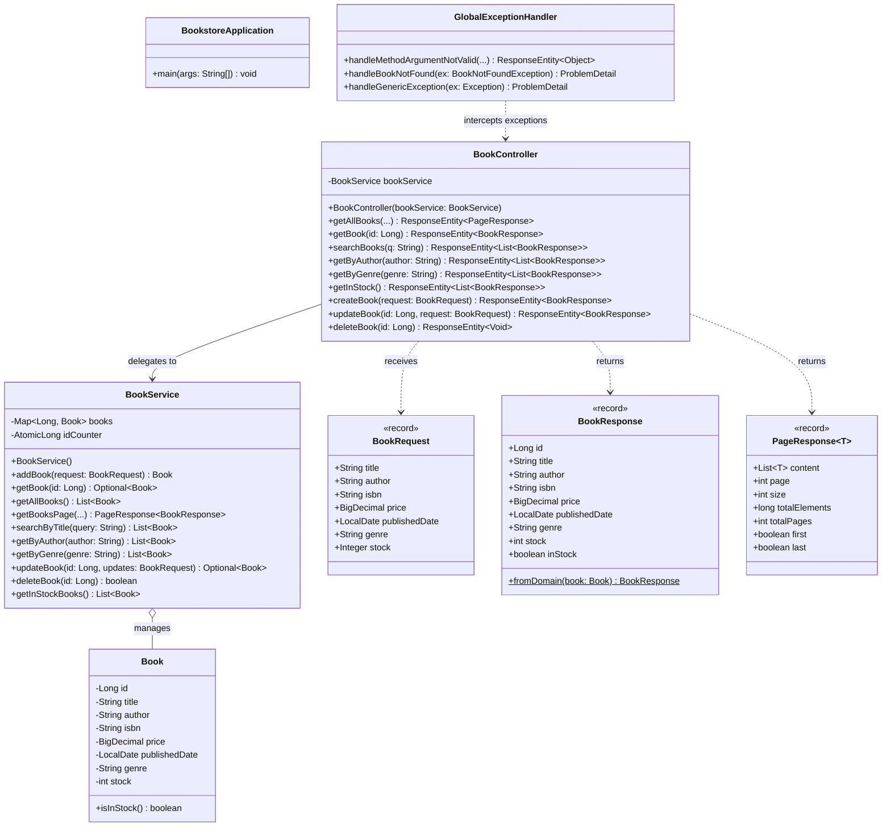
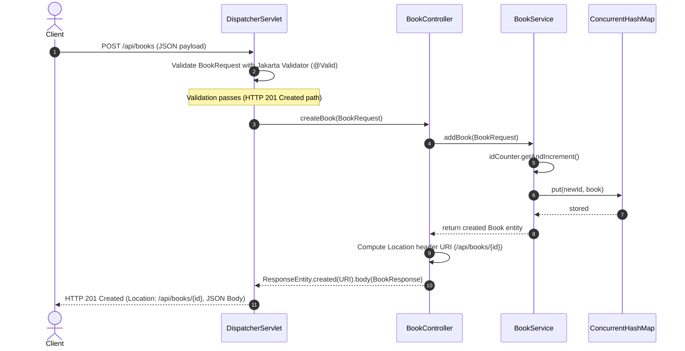
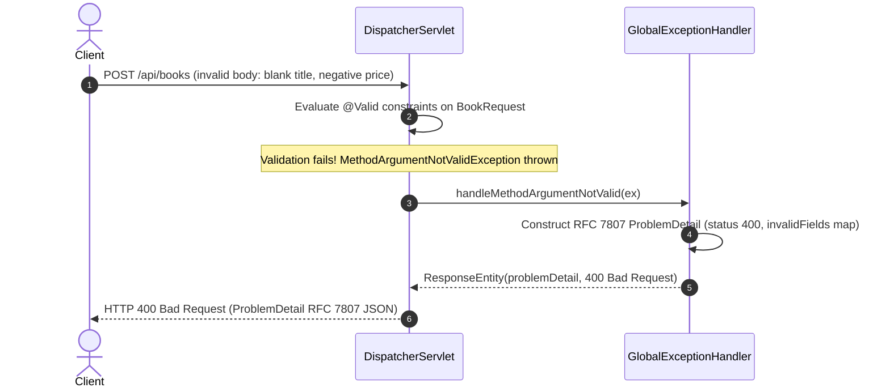
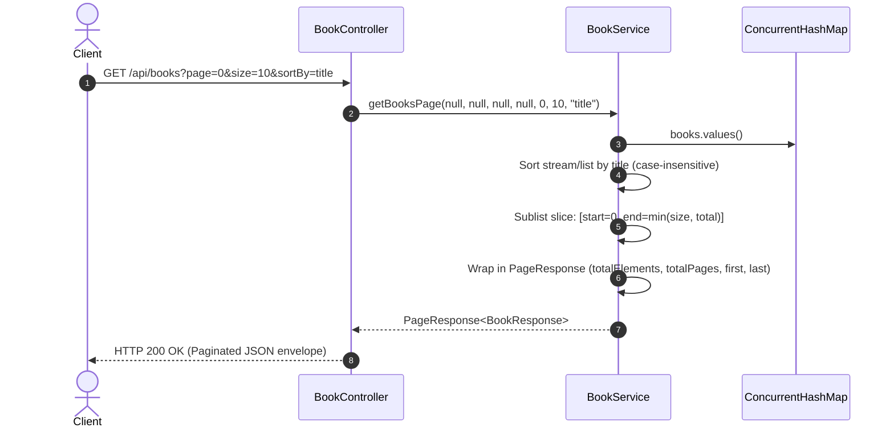

# Bookstore API Architecture

This document describes the architectural design, component structure, request lifecycle, and data flow of the Bookstore API application.

---

## 1. High-Level Architectural Overview

The Bookstore API is built using **Spring Boot 3.5** and **Java 21**, following modern Spring WebMVC layered architecture standards. Key patterns include:
- Immutable **Java 21 Records** for API Request and Response DTOs.
- Strong input validation using **Jakarta Bean Validation**.
- Standardized error reporting with **RFC 7807 `ProblemDetail`** via `@RestControllerAdvice`.
- **SpringDoc OpenAPI 3** automated documentation.
- Thread-safe in-memory domain storage (`ConcurrentHashMap` and `AtomicLong`).

```mermaid
flowchart TD
    subgraph Clients["Clients & Consumers"]
        Browser["Web Browser / Swagger UI"]
        HTTPClient["HTTP Client / curl / Postman"]
        Tests["Test Suites (MockMvc & JUnit 5)"]
    end

    subgraph SpringWeb["Spring Boot Web MVC Container"]
        Dispatcher["DispatcherServlet"]
        
        subgraph WebLayer["Presentation Layer (com.example.bookstore.controller)"]
            BC["BookController"]
            GEH["GlobalExceptionHandler (@RestControllerAdvice)"]
        end

        subgraph DTOLayer["DTO Layer (com.example.bookstore.dto)"]
            Req["BookRequest (Record)"]
            Resp["BookResponse (Record)"]
            Paged["PageResponse&lt;T&gt; (Record)"]
        end
        
        subgraph ServiceLayer["Service Layer (com.example.bookstore.service)"]
            BS["BookService (@Service)"]
        end
        
        subgraph DataLayer["Model & In-Memory Store (com.example.bookstore.model)"]
            Model["Book (Domain Entity)"]
            Storage["ConcurrentHashMap&lt;Long, Book&gt;"]
            Counter["AtomicLong (ID Generator)"]
        end
    end

    Browser -->|HTTP Requests| Dispatcher
    HTTPClient -->|HTTP Requests| Dispatcher
    Tests -->|Mock HTTP / Unit Tests| Dispatcher

    Dispatcher -->|Route Request| BC
    Dispatcher -.->|Intercept Exceptions| GEH

    BC -->|Validates & Binds| Req
    BC -->|Returns Envelope| Resp
    BC -->|Returns Paged Envelope| Paged
    BC -->|Invokes Operations| BS

    BS -->|Create / Update / Read| Model
    BS -->|Store / Retrieve / Remove| Storage
    BS -->|Generate Next ID| Counter
```

---

## 2. Layered Architecture & Responsibilities

| Layer | Primary Classes | Key Responsibilities |
|---|---|---|
| **Presentation Layer** | [BookController](src/main/java/com/example/bookstore/controller/BookController.java), [GlobalExceptionHandler](src/main/java/com/example/bookstore/controller/GlobalExceptionHandler.java) | Route HTTP requests, bind path/query variables, trigger `@Valid` checks, return `ResponseEntity` with standard status codes (`200`, `201` + `Location`, `204`, `400`, `404`). |
| **DTO Layer** | [BookRequest](src/main/java/com/example/bookstore/dto/BookRequest.java), [BookResponse](src/main/java/com/example/bookstore/dto/BookResponse.java), [PageResponse](src/main/java/com/example/bookstore/dto/PageResponse.java) | Immutable Java 21 `record`s defining client contract, schema documentation, and pagination metadata. |
| **Service Layer** | [BookService](src/main/java/com/example/bookstore/service/BookService.java) | Business logic execution, in-memory filtering, sorting, pagination, safe non-null mutation updates, thread-safe access control. |
| **Model / Storage Layer** | [Book](src/main/java/com/example/bookstore/model/Book.java) | Domain entity definition, constraint annotations, and concurrency-safe collection structures (`ConcurrentHashMap`, `AtomicLong`). |

---

## 3. Class Diagram & Component Relationships

```mermaid
classDiagram
    direction TB

    class BookstoreApplication {
        +main(args: String[]) void
    }

    class BookController {
        -BookService bookService
        +BookController(bookService: BookService)
        +getAllBooks(...) ResponseEntity~PageResponse~
        +getBook(id: Long) ResponseEntity~BookResponse~
        +searchBooks(q: String) ResponseEntity~List~BookResponse~~
        +getByAuthor(author: String) ResponseEntity~List~BookResponse~~
        +getByGenre(genre: String) ResponseEntity~List~BookResponse~~
        +getInStock() ResponseEntity~List~BookResponse~~
        +createBook(request: BookRequest) ResponseEntity~BookResponse~
        +updateBook(id: Long, request: BookRequest) ResponseEntity~BookResponse~
        +deleteBook(id: Long) ResponseEntity~Void~
    }

    class BookService {
        -Map~Long, Book~ books
        -AtomicLong idCounter
        +BookService()
        +addBook(request: BookRequest) Book
        +getBook(id: Long) Optional~Book~
        +getAllBooks() List~Book~
        +getBooksPage(...) PageResponse~BookResponse~
        +searchByTitle(query: String) List~Book~
        +getByAuthor(author: String) List~Book~
        +getByGenre(genre: String) List~Book~
        +updateBook(id: Long, updates: BookRequest) Optional~Book~
        +deleteBook(id: Long) boolean
        +getInStockBooks() List~Book~
    }

    class Book {
        -Long id
        -String title
        -String author
        -String isbn
        -BigDecimal price
        -LocalDate publishedDate
        -String genre
        -int stock
        +isInStock() boolean
    }

    class BookRequest {
        <<record>>
        +String title
        +String author
        +String isbn
        +BigDecimal price
        +LocalDate publishedDate
        +String genre
        +Integer stock
    }

    class BookResponse {
        <<record>>
        +Long id
        +String title
        +String author
        +String isbn
        +BigDecimal price
        +LocalDate publishedDate
        +String genre
        +int stock
        +boolean inStock
        +fromDomain(book: Book)$ BookResponse
    }

    class PageResponse~T~ {
        <<record>>
        +List~T~ content
        +int page
        +int size
        +long totalElements
        +int totalPages
        +boolean first
        +boolean last
    }

    class GlobalExceptionHandler {
        +handleMethodArgumentNotValid(...) ResponseEntity~Object~
        +handleBookNotFound(ex: BookNotFoundException) ProblemDetail
        +handleGenericException(ex: Exception) ProblemDetail
    }

    BookController --> BookService : delegates to
    BookController ..> BookRequest : receives
    BookController ..> BookResponse : returns
    BookController ..> PageResponse : returns
    BookService o-- Book : manages
    GlobalExceptionHandler ..> BookController : intercepts exceptions
```

---

## 4. Request Lifecycle & Sequence Flows

### 4.1 Successful Book Creation (`POST /api/books`)

```mermaid
sequenceDiagram
    autonumber
    actor Client
    participant DS as DispatcherServlet
    participant BC as BookController
    participant BS as BookService
    participant Store as ConcurrentHashMap

    Client->>DS: POST /api/books (JSON payload)
    DS->>DS: Validate BookRequest with Jakarta Validator (@Valid)
    Note over DS: Validation passes (HTTP 201 Created path)
    DS->>BC: createBook(BookRequest)
    BC->>BS: addBook(BookRequest)
    BS->>BS: idCounter.getAndIncrement()
    BS->>Store: put(newId, book)
    Store-->>BS: stored
    BS-->>BC: return created Book entity
    BC->>BC: Compute Location header URI (/api/books/{id})
    BC-->>DS: ResponseEntity.created(URI).body(BookResponse)
    DS-->>Client: HTTP 201 Created (Location: /api/books/{id}, JSON Body)
```

### 4.2 Validation Failure Flow (RFC 7807 `ProblemDetail`)

```mermaid
sequenceDiagram
    autonumber
    actor Client
    participant DS as DispatcherServlet
    participant GEH as GlobalExceptionHandler

    Client->>DS: POST /api/books (invalid body: blank title, negative price)
    DS->>DS: Evaluate @Valid constraints on BookRequest
    Note over DS: Validation fails! MethodArgumentNotValidException thrown
    DS->>GEH: handleMethodArgumentNotValid(ex)
    GEH->>GEH: Construct RFC 7807 ProblemDetail (status 400, invalidFields map)
    GEH-->>DS: ResponseEntity(problemDetail, 400 Bad Request)
    DS-->>Client: HTTP 400 Bad Request (ProblemDetail RFC 7807 JSON)
```

### 4.3 Paginated and Filtered Query Flow

```mermaid
sequenceDiagram
    autonumber
    actor Client
    participant BC as BookController
    participant BS as BookService
    participant Store as ConcurrentHashMap

    Client->>BC: GET /api/books?page=0&size=10&sortBy=title
    BC->>BS: getBooksPage(null, null, null, null, 0, 10, "title")
    BS->>Store: books.values()
    BS->>BS: Sort stream/list by title (case-insensitive)
    BS->>BS: Sublist slice: [start=0, end=min(size, total)]
    BS->>BS: Wrap in PageResponse (totalElements, totalPages, first, last)
    BS-->>BC: PageResponse<BookResponse>
    BC-->>Client: HTTP 200 OK (Paginated JSON envelope)
```

---

## 5. Technology Stack Summary

- **Runtime**: Java 21
- **Framework**: Spring Boot 3.5.7 (`spring-boot-starter-web`)
- **Validation**: Jakarta Bean Validation (`spring-boot-starter-validation`)
- **API Documentation**: SpringDoc OpenAPI UI 2.8.12 (`springdoc-openapi-starter-webmvc-ui`)
- **Testing**: JUnit 5, Mockito (`@MockitoBean`), Spring WebMvcTest (`spring-boot-starter-test`), AssertJ
- **Error Standard**: RFC 7807 / RFC 9457 `ProblemDetail` via `@RestControllerAdvice`
- **State Store**: In-Memory Thread-safe Collections (`ConcurrentHashMap`, `AtomicLong`)
