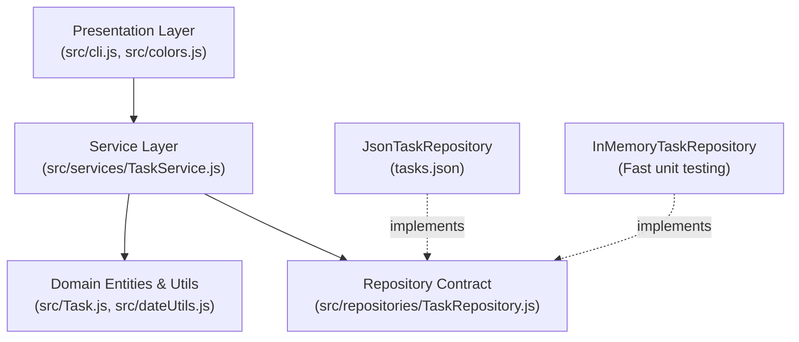

# Task Manager CLI

A modular, clean-architecture command-line task management tool built with Node.js ES modules. Features persistent JSON storage via the Repository Pattern, Dependency Injection in the Service Layer, ANSI color-coded status & priority badges, human-friendly date parsing, overdue indicators, category tags, and Markdown (`TODO.md`) export.

---

## Architecture & Design Patterns

The project follows **SOLID principles** and a **Layered Clean Architecture**:



### Applied Patterns & Principles

1. **Repository Pattern (`src/repositories/`)**:
   - `TaskRepository`: Abstract base class specifying CRUD contracts.
   - `JsonTaskRepository`: Handles JSON disk persistence, safe file creation, and syntax corruption detection.
   - `InMemoryTaskRepository`: Lightweight in-memory storage for high-speed unit testing with zero disk I/O.
2. **Dependency Injection & Service Layer (`src/services/TaskService.js`)**:
   - `TaskService` receives any `TaskRepository` implementation, isolating all business logic (validation, filtering, sorting, searching, status transitions) from the underlying storage mechanism.
3. **Facade Pattern (`src/taskManager.js`)**:
   - Provides a clean, backwards-compatible functional API wrapping the default `TaskService` and `JsonTaskRepository`.
4. **Single Responsibility & Pure Utilities**:
   - `src/Task.js` (Domain invariant encapsulation), `src/dateUtils.js` (Natural language date parsing), `src/colors.js` (ANSI styling).

---

## Key Features

- **Dual Interaction Modes**:
  - **Direct Non-Interactive Commands**: Fast terminal commands for scripts, aliases, and quick additions (`task add ...`, `task list`, `task done 1`).
  - **Interactive CLI Menu**: Interactive prompt loop powered by `node:readline/promises`.
- **Priority Levels**: Support for `high`, `medium`, and `low` with visual badges:
  - 🔴 `[HIGH]`
  - 🟡 `[MED]`
  - 🔵 `[LOW]`
- **Human-Friendly Due Dates & Overdue Alerts**:
  - Accepts natural phrases: `"today"`, `"tomorrow"`, `"+3d"`, `"+7days"`, or standard `YYYY-MM-DD`.
  - Automatically flags overdue pending tasks with `⚠️ [OVERDUE]`.
- **Category Tags**: Tag tasks (e.g. `work`, `urgent`, `dev`) and filter or search by tags (`task list --tag work`).
- **Markdown Export**: Export your tasks into a formatted `TODO.md` checklist (`task export`).
- **Zero External Runtime Dependencies**: Built entirely with native Node.js APIs.
- **Comprehensive Automated Test Suite**: 40 unit, integration, and architecture tests with Jest using `--experimental-vm-modules`.

---

## Project Structure

```text
my-task-manager/
├── src/
│   ├── Task.js                     # Domain model with priorities, tags, & overdue checks
│   ├── dateUtils.js                # Natural language date parsing & arithmetic
│   ├── colors.js                   # ANSI color constants & badge formatters
│   ├── taskManager.js              # Facade bridging to TaskService & default repository
│   ├── repositories/
│   │   ├── TaskRepository.js       # Abstract repository interface
│   │   ├── JsonTaskRepository.js   # JSON file persistence repository
│   │   └── InMemoryTaskRepository.js # In-memory repository for tests/ephemeral sessions
│   ├── services/
│   │   └── TaskService.js          # Business service orchestrating domain logic & repositories
│   └── cli.js                      # Direct CLI argument dispatcher & readline menu
├── tests/
│   ├── dateUtils.test.js           # Unit tests for date parsing & overdue logic
│   ├── repositories.test.js        # Tests for JsonTaskRepository & InMemoryTaskRepository
│   ├── taskService.test.js         # Tests for TaskService with Dependency Injection
│   └── taskManager.test.js         # Integration & edge-case test suite
├── package.json                    # ES module configuration & bin executables
├── tasks.json                      # Generated task persistence file (runtime)
└── README.md                       # Project documentation
```

---

## Installation & Setup

### Prerequisites

- **Node.js**: `v18.0.0` or later
- **npm**: `v9.0.0` or later

### Install Dependencies

```bash
cd exercises/my-task-manager
npm install
```

### Global CLI Access (Optional)

To use the `task` and `tasks` commands anywhere in your terminal:

```bash
npm link
```

---

## CLI Usage

### Direct Commands

```bash
# Add tasks (supports human dates, priorities, and tags)
task add "Fix authentication bug" --due tomorrow --priority high --tags "security,backend"
task add "Review quarterly report" --due +3d --priority medium --tags "finance"
task add "Buy groceries" --due today --priority low

# List tasks with filters & sorting
task list
task list --pending
task list --completed
task list --priority high
task list --tag security
task list --overdue
task list --sort-due
task list --sort-priority
task list --search "auth"

# Quick completion
task done 1

# Update tasks
task update 1 --priority low --due +5d

# Search tasks
task search "security"

# Delete a task
task remove 1

# Export tasks to Markdown checklist
task export TODO.md

# View help
task help
```

---

### Interactive Menu Mode

Launch the interactive prompt by running:

```bash
npm start
# or: node src/cli.js
```

---

## Running Tests

Run the complete test suite:

```bash
npm test
```

Run tests with code coverage:

```bash
npm test -- --coverage
```

---

## Programmatic API & Dependency Injection

You can use the default facade or construct custom services with your own storage backend:

```javascript
import { TaskService } from './src/services/TaskService.js';
import { JsonTaskRepository } from './src/repositories/JsonTaskRepository.js';
import { InMemoryTaskRepository } from './src/repositories/InMemoryTaskRepository.js';

// Production setup with JSON persistence
const repo = new JsonTaskRepository('./my-custom-tasks.json');
const taskService = new TaskService(repo);

// Or unit test setup with In-Memory storage (0 disk I/O)
const testService = new TaskService(new InMemoryTaskRepository());

// Add a task
const task = await taskService.addTask({
  title: 'Implement OAuth2 flow',
  dueDate: 'tomorrow',
  priority: 'high',
  tags: ['auth', 'api']
});

// List with criteria
const tasks = await taskService.listTasks({
  priority: 'high',
  tag: 'auth',
  sortByDueDate: 'asc'
});

// Mark as completed
await taskService.completeTask(task.id);
```

---

## License

MIT
