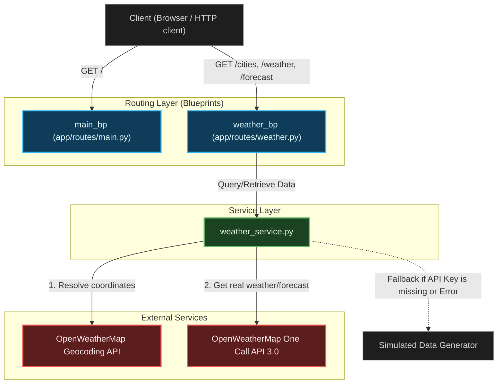

# Project Architecture Analysis: Weather App

This document provides a detailed analysis of the architecture and main components of the **Weather App** project, a Python Flask-based REST API designed for weather data retrieval.

---

## 1. Architectural Overview

The Weather App is structured as a modular Flask web application utilizing the **Application Factory Pattern** and clean separation of concerns:

- **Routing Layer (Blueprints)**: Handles incoming HTTP requests, route mapping, validation, API documentation headers, and HTTP responses.
- **Service Layer**: Implements business logic, coordinates calls to external APIs, performs mock-data simulation, and maps raw payloads into consistent schemas.
- **Testing Layer**: Comprises unit and integration tests using `pytest` to assert correct behavior under simulated/mocked external service states.

---

## 2. Main Components

### 2.1 Application Entry Point & Factory
* **[app.py](file:///Users/kennethkousen/Documents/OReilly/gemini-training/exercises/python/weather-app/app.py)**: The simple entry point that instantiates the Flask application using `create_app()` and launches the developmental server on port `5050` with debugging enabled.
* **[app/\_\_init\_\_.py](file:///Users/kennethkousen/Documents/OReilly/gemini-training/exercises/python/weather-app/app/__init__.py)**: Implements the **Application Factory** `create_app()`. It handles application configuration, registers Swagger UI via `flasgger`, and registers routing blueprints (`main_bp`, `weather_bp`).

### 2.2 Routing & Controller Layer
Located in [app/routes](file:///Users/kennethkousen/Documents/OReilly/gemini-training/exercises/python/weather-app/app/routes):
* **[app/routes/main.py](file:///Users/kennethkousen/Documents/OReilly/gemini-training/exercises/python/weather-app/app/routes/main.py)**: Contains the `main_bp` blueprint, exposing the `/` endpoint. It returns metadata about the API (version and available endpoints) and is decorated with Swagger docstrings.
* **[app/routes/weather.py](file:///Users/kennethkousen/Documents/OReilly/gemini-training/exercises/python/weather-app/app/routes/weather.py)**: Contains the `weather_bp` blueprint, mapping endpoints to service calls:
  - `GET /cities`: Returns a list of known/configured cities using `get_all_cities()`.
  - `GET /weather/<city_id>`: Returns the current weather using `get_weather_data()`. Returns `404` if the city cannot be resolved/simulated.
  - `GET /forecast/<city_id>`: Returns a 5-day weather forecast using `get_forecast_data()`. Returns `404` if the city cannot be resolved/simulated.
  - *Swagger Docs*: Fully documented using YAML specification strings inside route docstrings.

### 2.3 Service Layer
Located in [app/services](file:///Users/kennethkousen/Documents/OReilly/gemini-training/exercises/python/weather-app/app/services):
* **[app/services/weather_service.py](file:///Users/kennethkousen/Documents/OReilly/gemini-training/exercises/python/weather-app/app/services/weather_service.py)**: The core business logic component. It mediates access to external APIs or generates mock data:
  - **Fallback Capability**: If `OPENWEATHERMAP_API_KEY` is not present in the environment or if request errors occur, the service seamlessly falls back to local data generation (`_generate_simulated_weather` and `_generate_simulated_forecast`).
  - **Geocoding**: Translates user-provided city names into latitude/longitude coordinates via `_get_lat_lon_from_city_name` querying `api.openweathermap.org/geo/1.0/direct`.
  - **API Calls**: Pulls real weather/forecast metrics using the coordinates via `api.openweathermap.org/data/3.0/onecall` (`_fetch_real_weather` and `_fetch_real_forecast`).

---

## 3. Data Flow & External Integration

### Scenario A: Real Weather Data (API Key Present)
1. Request arrives at `/weather/london`.
2. Router calls `get_weather_data("london")`.
3. Geocoding API converts `"london"` to `lat: 51.5074, lon: -0.1278`.
4. One Call API fetches raw JSON from OpenWeatherMap.
5. Service extracts coordinates, temperature (current, min, max, feels like), condition, humidity, wind speed, and timestamp, mapping them into a clean, unified dictionary structure.
6. The JSON payload is returned to the user with `"source": "openweathermap"`.

### Scenario B: Simulated Data Fallback (API Key Absent or API Call Fails)
1. Request arrives at `/weather/london`.
2. Router calls `get_weather_data("london")`.
3. Since `API_KEY` is missing or geocoding fails, it calls `_generate_simulated_weather("london")`.
4. The service generates random weather variables (wind speed, condition, humidity, temperature within typical ranges).
5. The JSON payload is returned to the user with `"source": "simulated"`.

---

## 4. Testing Infrastructure

The test suite is built on `pytest` and divided into unit tests and mock-integrated tests:

* **[tests/test_weather.py](file:///Users/kennethkousen/Documents/OReilly/gemini-training/exercises/python/weather-app/tests/test_weather.py)**: Asserts endpoint routing behavior and correctness of returned HTTP statuses and structures. Uses mocks (`unittest.mock.patch`) to simulate missing API keys to verify the fallback logic.
* **[tests/test_weather_integration.py](file:///Users/kennethkousen/Documents/OReilly/gemini-training/exercises/python/weather-app/tests/test_weather_integration.py)**: Uses `unittest.mock.patch` to stub out calls to `requests.get` and internal lookup helpers. Contains mocked payloads mimicking OpenWeatherMap Geocoding and One Call 3.0 API structures to verify payload parsing and error handling behavior.

---

## 5. Architectural Strengths & Improvements

### Strengths
- **Resilience**: The application does not crash if the OpenWeatherMap API is down or missing credentials, falling back cleanly to simulated data.
- **Factory Pattern**: Separates application startup from configuration, facilitating mock/testing configurations.
- **Self-Documenting**: Embedded Swagger docs make the API developer-friendly right out of the box.

### Recommended Enhancements
- **Caching**: Weather data changes slowly; adding caching (e.g., memory-based or Redis) would prevent redundant, costly calls to external APIs.
- **Unified Error Handling**: Currently, exceptions are caught in services and print to stderr, returning generic fallback data. Adding a global Flask error-handling system would improve operational visibility.
