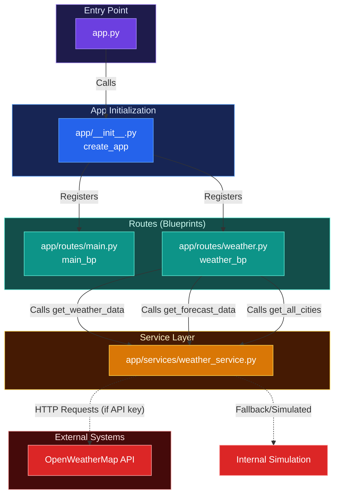

# Weather App

A simple Flask-based weather API for Gemini CLI training exercises.

## Architecture



## Setup

```bash
pip install -r requirements.txt
python app.py
```

## API Endpoints

- `GET /` - API documentation
- `GET /cities` - List available cities
- `GET /weather/<city_id>` - Get current weather
- `GET /forecast/<city_id>` - Get 5-day forecast (TODO)

## Exercise Goals

Use Gemini CLI to:
1. Explore and understand the codebase
2. Add comprehensive error handling
3. Implement the forecast endpoint
4. Add unit and integration tests
5. Create API documentation
6. Add caching for weather data
