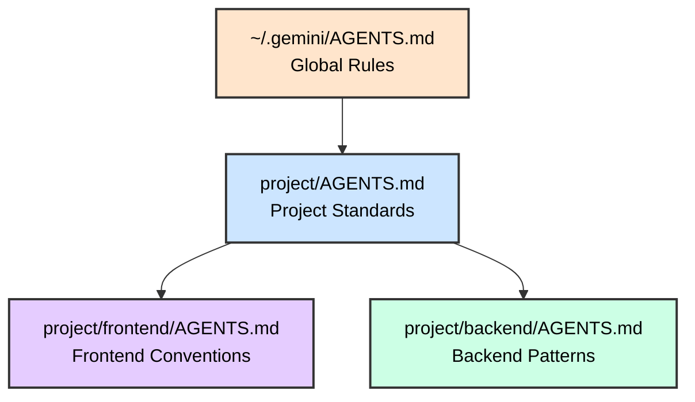

<style>
.slidev-page-num {
  display: block !important;
  opacity: 1 !important;
  visibility: visible !important;
  position: fixed !important;
  bottom: 1rem !important;
  right: 1rem !important;
  z-index: 100 !important;
  color: #666 !important;
  font-size: 0.875rem !important;
}
</style>

# Agentic Coding with Antigravity CLI

## Google's AI Agent in Your Terminal

<div class="pt-12">
  <span @click="$slidev.nav.next" class="px-2 py-1 rounded cursor-pointer" hover="bg-white bg-opacity-10">
    Press Space for next page <carbon:arrow-right class="inline"/>
  </span>
</div>

---

# Contact Info

Ken Kousen
Kousen IT, Inc.

- ken.kousen@kousenit.com
- http://www.kousenit.com
- http://kousenit.org (blog)
- Social Media:
  - [@kenkousen](https://twitter.com/kenkousen) (twitter)
  - [@kenkousen@foojay.social](https://foojay.social/@kenkousen) (mastodon)
  - [@kousenit.com](https://bsky.app/profile/kousenit.com) (bluesky)
- *Tales from the jar side* (free newsletter)
  - https://kenkousen.substack.com
  - https://youtube.com/@talesfromthejarside

---

# Course Overview

<v-clicks>

- **Duration**: 5 hours of hands-on learning
- **Format**: Instructor-led with multiple labs
- **Hands-on Labs**: Real codebases in Python, JavaScript, Java
- **Prerequisites**: Command-line experience, development background

</v-clicks>

---

# Topics Covered

<v-clicks>

- **Foundation**: Installation, CLI basics, authentication
- **Core Skills**: File operations, shell integration, context management
- **Customization**: AGENTS.md, skills, settings.json
- **Safety**: Execution modes, permission rules, sandbox, hooks
- **Advanced**: MCP integration, skills/plugins, session management

</v-clicks>

---

# What's New in Antigravity CLI 1.1.x

<v-clicks>

- **Execution modes**: `Shift+Tab` cycles `default` → `accept-edits` → `plan`; `--mode` flag (1.1.0)
- **Structured headless output**: `--output-format json|stream-json`, `--json-schema` (1.1.8)
- **Slash commands in `-p`**: skills expand; read-only commands answer without spending quota (1.1.9–1.1.12)
- **Model slugs + `--effort`**: pin `gemini-3.1-pro-high`, tune reasoning with `/effort` (1.1.5)
- **Custom agents in Markdown**: `agent.md` with YAML frontmatter; `--agent`, `agy agents` (1.1.1/1.1.6)
- **`/codesearch`** (1.1.3), **Vim editor mode** (1.1.11), `/fork`, `/btw`, `/rewind`
- **Direct Gemini API**: `GEMINI_API_KEY` + `modelProvider: "gemini"` — no sign-in (1.1.13)
- **Latest stable track**: Antigravity CLI `1.1.13` — see `agy changelog`

</v-clicks>

---

# What is Antigravity CLI?

<v-clicks>

- Google's Go-based AI coding agent for the terminal (binary: `agy`)
- **Multi-model**: Gemini 3.x, Claude Sonnet/Opus 4.6, GPT-OSS — switch with `/model`
- Built-in tools: web search, file ops, shell, web fetch
- Model Context Protocol (MCP) support via `mcp_config.json`
- Same `~/.gemini` config family as the Antigravity 2.0 desktop app and IDE

</v-clicks>

---

# Key Differentiators

<v-clicks>

- **Model choice**: mix Gemini, Claude, and GPT-OSS in one tool
- **Google Search Grounding**: real-time web access
- **Free tier + G1 credits**: keep working when quota runs out
- **Desktop continuity**: same account, quota, and `~/.gemini` config as Antigravity 2.0
- **MCP Native**: built-in Model Context Protocol support

</v-clicks>

---

# Models Available

<v-clicks>

- **Gemini 3.7 / 3.6 / 3.5 Flash**: fast Gemini models, each in Low/Medium/High effort
- **Gemini 3.1 Pro**: high-capability Gemini model for complex coding (Low/High)
- **Claude Sonnet 4.6 / Opus 4.6**: Anthropic models (thinking)
- **GPT-OSS 120B**: open-weights option
- **List models**: `agy models`  ·  **Switch**: `/model` or `--model <slug>`
- **Reasoning effort**: `--effort low|medium|high` or `/effort` mid-session

</v-clicks>

---

# Quota & Credits

<v-clicks>

- **Free tier**: sign in with a Google account to get started
- **G1 credits**: kick in automatically when standard quota runs out
- **In-CLI panels**: `/credits`, `/usage`, `/quota` for real-time status
- Manage models and preferences via `/settings`

</v-clicks>

📖 **Docs**: [antigravity.google/docs](https://antigravity.google/docs)

---

# Installation

<v-clicks>

- **macOS / Linux**: `curl -fsSL https://antigravity.google/cli/install.sh | bash`
- **Windows (PowerShell)**: `irm https://antigravity.google/cli/install.ps1 | iex`
- Installs the `agy` binary to `~/.local/bin/`
- Verify: `agy --version`  ·  Update: `agy update`  ·  What changed: `agy changelog`

</v-clicks>

```bash
# Install (macOS / Linux)
curl -fsSL https://antigravity.google/cli/install.sh | bash

# Verify installation
agy --version
```

---

# Authentication

<v-clicks>

- **Google Sign-In** (default): launches automatically on first run
- **Remote / SSH**: shows an authorization URL with a one-time code
- **API key (alternative)**: `export ANTIGRAVITY_API_KEY="your-key"`
- **Direct Gemini API** (1.1.13): `GEMINI_API_KEY` + `"modelProvider": "gemini"` in settings — no sign-in
- Enterprise: Business sign-in, Workforce Identity Federation, ADC (1.1.10)
- Credentials persist via OAuth in `~/.gemini/`

</v-clicks>

```bash
# First run: sign in with your Google account
agy

# Alternative: API key for scripts / headless use
export ANTIGRAVITY_API_KEY="your-api-key"
agy -p "Summarize this repo"

# Alternative: talk to the Gemini API directly (no Google sign-in)
export GEMINI_API_KEY="your-gemini-key"     # plus "modelProvider": "gemini" in settings.json
```

---

# Basic Usage Modes

<v-clicks>

- **Interactive REPL**: `agy` - Start a conversation
- **One-shot / print**: `agy -p "prompt"` - Single response
- **Piped input**: `echo "task" | agy -p`
- **Interactive with initial prompt**: `agy -i "initial context"`

</v-clicks>

```bash
# Interactive mode
agy

# One-shot (print) mode
agy -p "Explain what this codebase does"

# Start interactively with an initial prompt
agy -i "You are a Python expert"
```

---
layout: image-right
image: https://images.unsplash.com/photo-1555949963-ff9fe0c870eb?ixlib=rb-4.0.3&auto=format&fit=crop&w=1920&q=80
backgroundSize: cover
---

# Core Features

<div class="text-center mt-20">
  <h2 class="text-4xl font-bold text-white bg-black bg-opacity-60 px-6 py-3 rounded-lg">
    Essential Capabilities
  </h2>
  <p class="text-xl text-white bg-black bg-opacity-60 px-4 py-2 rounded mt-4">
    Master the fundamentals
  </p>
</div>

---

# File References with @

<v-clicks>

- Reference files directly: `@./src/main.js`
- Reference directories: `@./src/` (recursive)
- Reference images: `@./screenshot.png`
- Multiple references in one prompt

</v-clicks>

```bash
# Reference a specific file
agy -p "Explain @./src/app.py"

# Reference multiple files
agy -p "Compare @./old.js and @./new.js"

# Reference a directory
agy -p "Analyze the architecture in @./src/"
```

---

# Shell Integration with !

<v-clicks>

- Execute shell commands: `!git status`
- Toggle persistent shell mode: `!`
- The agent can observe and analyze output
- Combine with AI analysis

</v-clicks>

```bash
# In interactive mode:
> !npm test
# The agent sees the test output

> !git diff
# Ask the agent to analyze the changes

# Toggle persistent shell mode
> !
```

---

# Search the Workspace: `/codesearch`

<v-clicks>

- `/codesearch <query>` (aliases `/cs`, `/search`) — interactive regex search across the workspace
- `-F` / `--literal` for exact matching; `f:` / `file:` globs to include or exclude paths
- Falls back to a local search if `ripgrep` can't run (e.g. blocked by endpoint security)
- Cheaper than asking the agent to "find where X is used" — and you see the results yourself

</v-clicks>

```bash
> /cs def get_weather
> /cs -F "TODO:" file:*.py
```

---

# Slash Commands: Navigation

<v-clicks>

- `/help` - Show available commands and shortcuts
- `/context` - View loaded context and token usage
- `/model` · `/effort` - Switch model or reasoning effort mid-session
- `/settings` - Open settings and preferences
- `/codesearch <query>` (`/cs`) - Regex search across the workspace

</v-clicks>

---

# Slash Commands: Workflow

<v-clicks>

- `/agents` · `/tasks` - Monitor subagents and background tasks
- `/btw <question>` - Ask a side question without interrupting the current task
- `/permissions` - Add/edit/remove tool permission rules
- `/mcp` - View and reload MCP servers
- `/usage` - Session, quota, and rate-limit status

</v-clicks>

---

# Slash Commands: Session Control

<v-clicks>

- `/resume` - Open the conversation browser
- `/fork` - Clone the conversation into a parallel session
- `/rewind` - Roll back to an earlier message
- `/credits` · `/quota` - Credit balance and quota panels

</v-clicks>

---

# Slash Commands in Action (Context)

```bash
# Show what context is loaded and token usage
/context

# Switch the active model
/model

# Manage tool permission rules
/permissions

# Open settings and preferences
/settings
```

---

# Slash Commands in Action (Sessions)

```bash
# Open the conversation browser
/resume

# Branch this conversation into a parallel session
/fork

# Ask a quick side question without derailing the current task
/btw what does the retry decorator in @./src/utils.py do?
```

---

# Keyboard Shortcuts: Editing

<v-clicks>

- `Ctrl+L` - Clear screen
- `Ctrl+V` - Paste text/images
- `Ctrl+R` - Open the Artifact Review panel

</v-clicks>

---

# Keyboard Shortcuts: Control

<v-clicks>

- `Esc` - Interrupt the active agent stream
- `Ctrl+C` - Cancel current operation
- `Ctrl+D` `Ctrl+D` - Exit Antigravity CLI (press twice)
- `Ctrl+G` - Edit a long prompt in `$EDITOR`

</v-clicks>

---

# Vim Editor Mode

<v-clicks>

- `/settings` → **Editor Mode** → `vim` (or `"editorMode": "vim"` in settings.json)
- Normal / Insert / Visual modes, a mode badge in the status line
- Motions, operators, text objects: `w` `b` `e` `0` `$` `gg` `G` `d` `c` `y` `iw` `ap` …
- **Insert First** option: open each prompt in Insert mode so bare `Enter` submits
- Remap anything under `vim.*` in `~/.gemini/antigravity-cli/keybindings.json`

</v-clicks>

```bash
# Persist it
{ "editorMode": "vim", "vimInsertFirst": true }
```

---

# Built-in Tools

<v-clicks>

- **File System**: `read_file()`, `write_file()`, `replace()`, `glob()`
- **Shell**: Execute terminal commands
- **Web**: `google_web_search()`, `web_fetch()`
- **Memory**: `save_memory()` for cross-session recall

</v-clicks>

```bash
# The agent automatically uses appropriate tools
"Search the web for React 19 new features"
# Uses google_web_search()

"Read all Python files in src/"
# Uses glob() and read_file()

"Update the README with the changes we made"
# Uses write_file()
```

---
layout: image-right
image: https://images.unsplash.com/photo-1488590528505-98d2b5aba04b?ixlib=rb-4.0.3&auto=format&fit=crop&w=1920&q=80
backgroundSize: cover
---

# Safety & Control

<div class="mt-20">
  <h2 class="text-4xl font-bold text-white bg-black bg-opacity-60 px-6 py-3 rounded-lg">
    Work Safely
  </h2>
  <p class="text-xl text-white bg-black bg-opacity-60 px-4 py-2 rounded mt-4">
    Permission rules and sandboxing
  </p>
</div>

---

# Tool Permissions

<v-clicks>

- **Default** (`request-review`): prompt for approval on each tool call
- **`/permissions`**: add, edit, or remove allow/deny rules in-CLI
- **`toolPermission`** setting: `request-review` · `proceed-in-sandbox` · `strict` · `always-proceed`
- **`--dangerously-skip-permissions`**: auto-approve everything (use with care)

</v-clicks>

```bash
# Default - interactive, prompts per tool call
agy

# Auto-approve all tool calls (use with care)
agy --dangerously-skip-permissions

# Manage allow/deny rules from inside a session
> /permissions
```

---

# Execution Modes

<v-clicks>

- **`default`**: pauses for an interactive diff review before writing files (`f` = full diff)
- **`accept-edits`**: auto-approves file edits and creations
- **`plan`**: prepends `/plan` — analyze and outline before writing code
- **Cycle** with `Shift+Tab`; the current mode shows in the status line
- `/planning` and `/fast` were removed in 1.1.0

</v-clicks>

```bash
# Pick a mode at launch
agy --mode accept-edits
agy --mode plan

# Persist a default in ~/.gemini/antigravity-cli/settings.json
{ "agentMode": "accept-edits" }
```

---

# Artifact Review

<v-clicks>

- Review proposed changes before they are applied
- Open the **Artifact Review panel** with `Ctrl+R`
- Inspect diffs with `/diff` (supports commit-hash selection)
- Works even while answering pending tool-permission prompts
- Great safety habit when exploring an unfamiliar codebase

</v-clicks>

```bash
# Inspect changes from inside a session
> /diff

# Toggle the Artifact Review panel
Ctrl+R
```

---

# Sandbox Mode

<v-clicks>

- Isolate file operations away from your host
- Multiple backends depending on your OS
- Prevents accidental system changes
- Perfect for exploring unfamiliar code

</v-clicks>

```bash
# Run in sandbox mode (terminal restrictions enabled)
agy --sandbox

# Combine with a one-shot prompt
agy --sandbox -p "Refactor this entire codebase"
```

---

# Sandbox & Permission Modes

<v-clicks>

- **`--sandbox`**: run with terminal restrictions enabled
- **`proceed-in-sandbox`** permission mode: auto-approve commands that
  stay inside the sandbox, prompt only when one tries to break out
- Sandbox isolation is enforced in headless print mode too (`-p`)
- Pair with `/permissions` rules for durable guardrails

</v-clicks>

```bash
# Interactive, sandboxed
agy --sandbox

# Non-interactive, sandbox still enforced
agy --sandbox -p "Audit @./src for risky calls"
```

📖 [antigravity.google/docs](https://antigravity.google/docs)

---

# Undo & Recovery

<v-clicks>

- **Before the write**: the default mode pauses on a diff — reject what you don't want
- **`/rewind`**: roll the conversation back to an earlier message
- **`/diff`**: see what the agent changed in this session
- **`/fork`**: branch before a risky experiment; `/resume` / `agy -c` to come back
- **Your repo is the real safety net**: commit before big asks, `git checkout -- .` to undo

</v-clicks>

```bash
# Roll the conversation back, then try a different approach
> /rewind

# Inspect what changed before you commit
> /diff
git diff
```

---
layout: image-left
image: https://images.unsplash.com/photo-1454165804606-c3d57bc86b40?ixlib=rb-4.0.3&auto=format&fit=crop&w=1920&q=80
backgroundSize: cover
---

# Context Management

<div class="text-center mt-20">
  <h2 class="text-4xl font-bold text-white bg-black bg-opacity-60 px-6 py-3 rounded-lg">
    AGENTS.md Files
  </h2>
  <p class="text-xl text-white bg-black bg-opacity-60 px-4 py-2 rounded mt-4">
    Project memory and instructions
  </p>
</div>

---

# What is AGENTS.md?

<v-clicks>

- **Project memory** loaded automatically
- **Coding standards** and conventions
- **Architecture context** for the AI
- **Persistent instructions** across sessions
- Antigravity also recognizes `GEMINI.md` and `CLAUDE.md`

</v-clicks>

---

# Hierarchical Loading



More specific files override general ones

---

# Example AGENTS.md

```markdown
# Project: Weather API
## Tech Stack
- Backend: Python Flask
- Database: PostgreSQL
- Testing: pytest
## Coding Standards
- Use type hints for all functions
- Follow PEP 8 style guide
- Write docstrings for public APIs
## Current Focus
Implementing caching layer for API responses
```

---

# Managing Context

<v-clicks>

- Edit `AGENTS.md` directly to update project memory
- `/context` - view combined context and token usage
- Add `includeDirectories` in settings to load shared context
- Restart or reload the session to pick up changes

</v-clicks>

```bash
# Create or edit project memory
$EDITOR AGENTS.md

# See what context is loaded
> /context
```

---

# Modular Imports

<v-clicks>

- Import other files with `@file.md` syntax
- Break large context into components
- Supports relative and absolute paths

</v-clicks>

```markdown
# AGENTS.md

## Project Overview
@./docs/architecture.md

## Coding Standards
@./docs/style-guide.md

## API Documentation
@./docs/api-reference.md
```

---
layout: image-right
image: https://images.unsplash.com/photo-1558494949-ef010cbdcc31?ixlib=rb-4.0.3&auto=format&fit=crop&w=1920&q=80
backgroundSize: cover
---

# Configuration

<div class="mt-20">
  <h2 class="text-4xl font-bold text-white bg-black bg-opacity-60 px-6 py-3 rounded-lg">
    Customize Your Setup
  </h2>
  <p class="text-xl text-white bg-black bg-opacity-60 px-4 py-2 rounded mt-4">
    settings.json and environment
  </p>
</div>

---

# Configuration Layers

<v-clicks>

1. **Default values** - Built-in defaults
2. **User settings** - `~/.gemini/antigravity-cli/settings.json` (edit via `/settings`)
3. **Workspace files** - `.agents/mcp_config.json`, `.agents/agents/`, `AGENTS.md`
4. **Environment variables** - e.g. `GEMINI_API_KEY`, `AGY_CLI_CMD_OUTPUT_PERCENTAGE`
5. **Command-line arguments** - `--mode`, `--model`, `--effort`, … highest priority

</v-clicks>

---

# settings.json Options

`~/.gemini/antigravity-cli/settings.json` — a flat key/value file:

```json
{
  "agentMode": "accept-edits",
  "toolPermission": "request-review",
  "artifactReviewPolicy": "asks-for-review",
  "enableTerminalSandbox": false,
  "editor": "auto",
  "editorMode": "vim"
}
```

---

# settings.json Options (UI + Permissions)

```json
{
  "showTips": true,
  "notifications": true,
  "colorScheme": "terminal",
  "permissions": {
    "allow": ["command(git status)", "command(npm test)"]
  },
  "trustedWorkspaces": ["/path/to/project"]
}
```

Full list: `/settings` in-session, or `agy -p "/settings"` to dump current values.

---

# Status Line Customization

<v-clicks>

- The bar under the prompt shows model, mode, and quota by default
- `/statusline` opens the customization overlay
- Or point `statusLine` at your own script — it receives session JSON on stdin

</v-clicks>

```json
{
  "statusLine": {
    "type": "command",
    "command": "~/.local/bin/agy-statusline.sh",
    "enabled": true
  }
}
```

A working Python example lives in `exercises/python/weather-app/statusline.py`.

---

# Tool Permissions & Rules

<v-clicks>

- **`/permissions`**: add, edit, or remove allow/deny rules in-CLI
- Rules merge across three layers: project, user, and CLI settings
- Shared with the Antigravity desktop app's permission settings
- Keep high-risk tools constrained for teams

</v-clicks>

```bash
# Manage permission rules interactively
> /permissions

# Auto-approve everything (use with care)
agy --dangerously-skip-permissions
```

📖 [antigravity.google/docs](https://antigravity.google/docs)

---

# File Filtering

<v-clicks>

- **respectGitIgnore**: Honor .gitignore patterns
- **enableRecursiveFileSearch**: Recursive completion
- Exclude rules and allowlists live in `rules.json`

</v-clicks>

```json
{
  "context": {
    "fileFiltering": {
      "respectGitIgnore": true,
      "enableRecursiveFileSearch": true
    }
  }
}
```

---

# Environment Variables

| Variable | Purpose |
|----------|---------|
| `ANTIGRAVITY_API_KEY` | API-key authentication (alternative to sign-in) |
| `AGY_CLI_DISABLE_LATEX` | Turn off LaTeX math rendering |
| `AGY_CLI_HIDE_ACCOUNT_INFO` | Hide email and plan tier from the header |
| `$EDITOR` | External editor for prompts and files |
| `HTTP_PROXY` | Network proxy |

---

# Custom Context Filenames

<v-clicks>

- **`AGENTS.md`** is the documented default context file
- `GEMINI.md` and `CLAUDE.md` are also recognized
- Global rules: `~/.gemini/AGENTS.md`; per-directory files nest under the project
- Add extra directories to the workspace with `--add-dir` or `/add-dir`

</v-clicks>

```bash
# Bring shared context from another directory into the workspace
agy --add-dir ~/shared-context

# ...or mid-session
> /add-dir ~/shared-context
```

---
layout: image-right
image: https://images.unsplash.com/photo-1516321318423-f06f85e504b3?ixlib=rb-4.0.3&auto=format&fit=crop&w=1920&q=80
backgroundSize: cover
---

# Advanced Features

<div class="mt-20">
  <h2 class="text-4xl font-bold text-white bg-black bg-opacity-60 px-6 py-3 rounded-lg">
    Power User Tools
  </h2>
  <p class="text-xl text-white bg-black bg-opacity-60 px-4 py-2 rounded mt-4">
    MCP, Plugins, Sessions
  </p>
</div>

---

# Model Context Protocol (MCP)

<v-clicks>

- Standard protocol for AI-to-system connections
- Connect to external tools and services
- Supports local commands, HTTP, and SSE
- OAuth 2.0 for remote authentication

</v-clicks>

---

# MCP Configuration: Firecrawl

```json
{
  "mcpServers": {
    "firecrawl": {
      "command": "npx",
      "args": ["-y", "firecrawl-mcp"],
      "env": {
        "FIRECRAWL_API_KEY": "${FIRECRAWL_API_KEY}"
      }
    }
  }
}
```

---

# MCP Configuration: Database

```json
{
  "mcpServers": {
    "postgres": {
      "command": "npx",
      "args": ["@modelcontextprotocol/server-postgres"],
      "env": {
        "CONNECTION_STRING": "${DATABASE_URL}"
      }
    }
  }
}
```

---

# Managing MCP Servers

Edit the config file directly, then reload from `/mcp`:

```bash
# Global config
$EDITOR ~/.gemini/config/mcp_config.json

# Per-project config (checked into the repo)
$EDITOR .agents/mcp_config.json
```

```json
{
  "mcpServers": {
    "github": {
      "command": "npx",
      "args": ["-y", "@modelcontextprotocol/server-github"]
    }
  }
}
```

Servers initialize in parallel on startup.

---

# MCP: Remote Servers

Use `serverUrl` for HTTP/SSE remote MCP servers (`url`/`httpUrl` are **not** supported):

```json
{
  "mcpServers": {
    "remote-tools": {
      "serverUrl": "https://mcp.example.com/sse",
      "headers": { "Authorization": "Bearer ${MY_TOKEN}" }
    }
  }
}
```

Per-project servers go in `.agents/mcp_config.json`. Reload with `/mcp`.

---

# MCP Server Options

<v-clicks>

- **command**: Shell command to start server
- **args**: Command arguments
- **env**: Environment variables
- **cwd**: Working directory

</v-clicks>

---

# MCP Server Options (Advanced)

<v-clicks>

- **`disabled`**: keep a server configured but switched off
- **`disabledTools`**: withhold specific tools from the agent
- **`headers`** / **`oauth`** / **`authProviderType: "google_credentials"`**: remote auth
- **`env`**, **`cwd`**: environment and working directory for stdio servers

</v-clicks>

---

# Popular MCP Servers

<v-clicks>

- **Firecrawl** - Web scraping, search, content extraction
- **PostgreSQL** - Database queries and schema
- **Filesystem** - Extended file operations
- **Slack** - Team communication
- **Playwright** - Browser automation

</v-clicks>

📖 **Registry**: [modelcontextprotocol.io/registry](https://modelcontextprotocol.io/registry)

---

# Plugins from Marketplaces

<v-clicks>

- Install from a marketplace with `plugin@marketplace` syntax
- Plugins bundle **skills** and **subagents**, discovered automatically
- Import existing Gemini or Claude plugins with `agy plugin import`
- Plugins install to the shared `~/.gemini/config/` directory

</v-clicks>

```bash
# Install, then link a marketplace
agy plugin install my-plugin@my-marketplace
agy plugin link my-marketplace ./target
```

📖 [antigravity.google/docs](https://antigravity.google/docs)

---

# Subagents

<v-clicks>

- Ask the agent to **delegate**: it dispatches a subagent via `invoke_subagent`
- Define your own in Markdown: `.agents/agents/<name>.md` (or `~/.gemini/config/agents/`)
- Frontmatter: `subagent: true`, `mainAgent`, `model: flash|pro|inherit`, `hidden`, `inheritMcp`
- Monitor with `/agents`; background shell tasks with `/tasks`; ask a side question with `/btw`
- Launch straight into a custom agent: `agy --agent <name>` · list with `agy agents`

</v-clicks>

```markdown
---
subagent: true
model: flash
---
# Test writer
You write focused unit tests. Never modify source files.
```

---

# Plugin System

<v-clicks>

- Extend Antigravity CLI with **plugins** (skills + subagents)
- Managed with the `agy plugin` subcommand
- Import from Gemini or Claude: `agy plugin import gemini`
- Installed plugins are scanned for skills and agents automatically

</v-clicks>

```bash
# List installed plugins
agy plugin list

# Install / enable / disable
agy plugin install my-plugin@marketplace
agy plugin enable my-plugin
agy plugin disable my-plugin
```

---

# Skills

<v-clicks>

- Package reusable expert workflows as **skills**: a folder with a `SKILL.md`
- Frontmatter `name` + `description` — the agent reads the description to decide when to use it
- Live in `.agents/skills/` (project, checked in) or `~/.gemini/config/skills/` (global), or inside plugins
- Surface as `/name` slash commands via autocomplete; `/skills` lists them
- This repo ships four in `skills/`: `/review`, `/test-gen`, `/docs`, `/refactor`

</v-clicks>

```markdown
---
name: review
description: Perform a code review. Use when the user runs /review on a file.
---
# /review
Review the referenced code for security, performance, and test gaps…
```

---

# Lifecycle Hooks

<v-clicks>

- Shell commands that run at fixed points in the agent loop — `hooks.json` in `~/.gemini/config/` or inside a plugin
- **`PreToolUse`** — gate or rewrite a tool call: return `allow` / `deny` / `ask` (matcher on tool name, e.g. `run_command`)
- **`PostToolUse`** — run a linter or tests after a tool finishes
- **`PreInvocation` / `PostInvocation`** — inject context before the model runs; force-continue after
- **`Stop`** — notify, or refuse to stop until goals are met
- JSON in on stdin, JSON out on stdout; `/hooks` shows what's loaded

</v-clicks>

---

# Hooks: Examples

```json
{
  "no-force-push": {
    "PreToolUse": [{
      "matcher": "run_command",
      "hooks": [{ "command": "./scripts/block-force-push.sh" }]
    }]
  },
  "notify-done": {
    "Stop": [{ "command": "osascript -e 'display notification \"agy finished\"'; echo '{}'" }]
  }
}
```

```bash
# block-force-push.sh — stdin has {"toolCall":{"name":"run_command","args":{"CommandLine":"..."}}}
if grep -q 'push.*--force' <<< "$(cat)"; then
  echo '{"decision":"deny","reason":"No force pushes from the agent"}'
else
  echo '{"decision":"allow"}'
fi
```

Example `config-examples/hooks.json` in this repo. ⚠️ As of 1.1.13 the CLI loads hooks from `~/.gemini/config/` and plugins — a workspace `.agents/hooks.json` is documented but not picked up yet (verified).

---

# Session Management

<v-clicks>

- **Continue**: pick up the most recent conversation
- **Resume by ID**: jump to a specific past conversation
- **Browse**: open the conversation picker with `/resume`
- Conversations are stored in SQLite (`.db`)

</v-clicks>

```bash
# Continue the most recent conversation
agy -c

# Resume a specific conversation by ID
agy --conversation <id>

# Browse conversations from inside a session
> /resume
```

---

# Non-Interactive (Print) Mode

<v-clicks>

- **`-p` / `--print`**: run a single prompt and print the response
- **`--output-format`**: `text` (default) · `json` (one envelope) · `stream-json` (NDJSON events)
- **`--json-schema`**: constrain the answer to a schema (inline or file path)
- **`--print-timeout`**: bound how long print mode waits (default 5m)
- Skills expand in `-p` (`agy -p "/my-skill …"`); read-only commands like `/settings`, `/quota` answer without spending quota

</v-clicks>

```bash
# One-shot print mode, piped input
cat error.log | agy -p "Diagnose this stack trace"

# Machine-readable: {"status":"SUCCESS","response":"…","usage":{…}}
agy -p "Summarize @./README.md" --output-format json

# Enforce a schema; result lands in "structured_output"
agy -p "Extract version from @./package.json" --output-format json \
    --json-schema '{"type":"object","properties":{"version":{"type":"string"}}}'
```

---

# Desktop Integration

<v-clicks>

- **Antigravity 2.0 desktop app** and IDE live alongside the CLI under `~/.gemini`
- **Shared MCP config**: `~/.gemini/config/mcp_config.json`
- **Shared permissions**: rules carry across CLI and desktop
- **External editor**: set `$EDITOR` for prompt and file editing

</v-clicks>

```bash
# Open a file in your external editor from inside a session
> /open src/app.py

# Long prompt? ctrl+g opens $EDITOR for the prompt box
```

---
layout: image-left
image: https://images.unsplash.com/photo-1498050108023-c5249f4df085?ixlib=rb-4.0.3&auto=format&fit=crop&w=1920&q=80
backgroundSize: cover
---

# Practical Applications

<div class="mt-20">
  <h2 class="text-4xl font-bold text-white bg-black bg-opacity-70 px-6 py-3 rounded-lg">
    Real-World Workflows
  </h2>
  <p class="text-xl text-white bg-black bg-opacity-70 px-4 py-2 rounded mt-4">
    Common use cases
  </p>
</div>

---

# Code Exploration

<v-clicks>

- Understand unfamiliar codebases
- Trace dependencies and data flow
- Find patterns and conventions
- Generate architecture documentation

</v-clicks>

```bash
agy -p "Analyze the architecture of @./src/ and explain
how the components interact"

agy -p "Trace the flow from the API endpoint to the database
in @./src/controllers/ and @./src/services/"
```

---

# Test Generation

<v-clicks>

- Generate unit tests for existing code
- Identify edge cases automatically
- Create integration test scaffolding
- Mock setup and fixtures

</v-clicks>

```bash
agy -p "Create comprehensive unit tests for @./src/utils.py
with pytest, including edge cases"

agy -p "Generate integration tests for @./src/api/users.py
with proper mocking"
```

---

# Documentation Generation

<v-clicks>

- README files for projects
- API documentation
- Architecture diagrams (Mermaid)
- Code comments and docstrings

</v-clicks>

```bash
agy -p "Generate a comprehensive README.md for this project"

agy -p "Add detailed docstrings to all public functions
in @./src/services/"

agy -p "Create a Mermaid diagram showing the system architecture"
```

---

# Refactoring & Modernization

<v-clicks>

- Upgrade legacy code patterns
- Apply modern language features
- Improve code organization
- Fix anti-patterns

</v-clicks>

```bash
agy -p "Refactor @./src/legacy.py to use modern Python 3.12
features like type hints and match statements"

agy -p "Convert this callback-based code to async/await
@./src/api.js"
```

---

# Debugging Workflows

<v-clicks>

- Analyze error messages and stack traces
- Identify root causes
- Suggest fixes with context
- Test and verify solutions

</v-clicks>

```bash
agy -p "This test is failing with @./tests/output.log.
Analyze the error and fix the issue in @./src/app.py"

agy -p "Debug why the API returns 500 errors.
Check @./src/routes.py and @./src/middleware.py"
```

---

# Git Workflows

<v-clicks>

- Generate commit messages
- Create pull request descriptions
- Analyze diffs and changes
- Resolve merge conflicts

</v-clicks>

```bash
# Analyze staged changes
!git diff --staged
"Generate a conventional commit message for these changes"

# Create PR description
"Create a pull request description summarizing the changes
from the last 5 commits"
```

---

# CI/CD Integration

<v-clicks>

- Non-interactive `--print` mode for pipelines
- Capture stdout to a file for parsing
- Exit codes for success/failure
- Automated code reviews

</v-clicks>

```bash
# In CI/CD pipeline
agy -p "Review @./src/ for security issues" > review.txt

# Check exit code
if agy -p "Verify all tests pass"; then
  echo "All checks passed"
fi
```

---
layout: image-right
image: https://images.unsplash.com/photo-1522071820081-009f0129c71c?ixlib=rb-4.0.3&auto=format&fit=crop&w=1920&q=80
backgroundSize: cover
---

# Optional Advanced Module

<v-clicks>

- Designed for teams moving from personal usage to production workflows
- Can be taught live or assigned as follow-up practice
- Focus areas: auth strategy, governance, skills/MCP, CI automation

</v-clicks>

---

# Authentication Matrix (Team Use)

<v-clicks>

- **Google Sign-In**: best default for local interactive usage
- **Device-code flow**: shows a URL + code for remote/SSH machines
- **`ANTIGRAVITY_API_KEY`**: scripts and headless automation
- **G1 credits**: keep teams productive past standard quota

</v-clicks>

---

# Auth Quick Checks

```bash
# Interactive route: sign in with Google on first run
agy

# API-key route (scripts / headless)
export ANTIGRAVITY_API_KEY="..."
agy -p "Summarize @./src"

# Hide account info from the header (e.g. for screen sharing)
export AGY_CLI_HIDE_ACCOUNT_INFO=1
agy
```

---

# Governance: Permissions and Rules

<v-clicks>

- `--dangerously-skip-permissions` is a per-session escape hatch
- `/permissions` rules provide durable guardrails across users/projects
- `PreToolUse` hooks (`~/.gemini/config/hooks.json`, or shipped in a plugin) enforce policy the rules can't express
- Keep high-risk tools constrained in team settings
- Prefer explicit allow/deny patterns over ad-hoc approvals

</v-clicks>

---

# Governance: Folder Trust

<v-clicks>

- Antigravity tracks trusted folders (`trustedWorkspaces` in `settings.json`)
- Folder trust impacts settings, skills, and context loading
- Treat untrusted repos with `--sandbox` and stricter rules
- Combine with `/permissions` for auditable guardrails

</v-clicks>

---

# Skills + MCP at Scale

<v-clicks>

- Skills package repeatable expert workflows for teams
- MCP connects external systems (docs, data, browsers, APIs)
- Distribute skills and subagents together inside plugins
- Use `disabledTools` to narrow risky MCP exposure

</v-clicks>

---

# Plugins + MCP Commands

```bash
# Plugin (skills + subagents) lifecycle
agy plugin list
agy plugin disable my-plugin
agy plugin enable my-plugin

# MCP servers: edit config, then restart to reload
$EDITOR ~/.gemini/config/mcp_config.json
```

---

# Automation Patterns (Non-Interactive)

<v-clicks>

- Prefer `--print` for non-interactive runs
- Use exit codes for pipeline gates
- Keep prompts deterministic and repo-scoped
- Store logs/artifacts for auditability

</v-clicks>

---

# CI Example: Gate + Report

```bash
# Human-readable report for the PR
agy -p "Review @./src/ for security issues" > review.txt

# Machine-readable gate: force a yes/no answer with a schema
verdict=$(agy -p "Does @./src/ contain any CRITICAL security issue?" \
  --output-format json \
  --json-schema '{"type":"object","properties":{"critical":{"type":"boolean"}}}' \
  | jq -r '.structured_output.critical')

[ "$verdict" = "false" ] || { echo "Gate failed — see review.txt"; exit 1; }
```

Non-zero exit = the run itself failed (`status` ≠ `SUCCESS`); the schema gives you the *verdict*.

---
layout: image-right
image: https://images.unsplash.com/photo-1522071820081-009f0129c71c?ixlib=rb-4.0.3&auto=format&fit=crop&w=1920&q=80
backgroundSize: cover
---

# Best Practices

<div class="text-center mt-20">
  <h2 class="text-4xl font-bold text-white bg-black bg-opacity-60 px-6 py-3 rounded-lg">
    Professional Workflows
  </h2>
  <p class="text-xl text-white bg-black bg-opacity-60 px-4 py-2 rounded mt-4">
    Tips for success
  </p>
</div>

---

# Effective Prompting

<v-clicks>

- **Be specific** about what you want to achieve
- **Provide context** about goals and constraints
- **Use file references** to ground the conversation
- **Iterate** for complex tasks
- **Include examples** when possible

</v-clicks>

---

# Safety Guidelines

<v-clicks>

- **Start in default mode** - Get comfortable first
- **Enable checkpointing** - Safety net for mistakes
- **Review generated code** - Don't blindly accept
- **Use sandbox** for exploratory work
- **Commit often** - Git is your safety net

</v-clicks>

---

# Project Setup

<v-clicks>

1. Create a comprehensive AGENTS.md
2. Set up project-specific settings.json
3. Configure relevant MCP servers
4. Create skills for common tasks
5. Establish team conventions

</v-clicks>

---

# AGENTS.md Best Practices

<v-clicks>

- **Keep it focused** - Relevant project info only
- **Update regularly** - Reflect current state
- **Use imports** - Modularize large contexts
- **Include examples** - Show expected patterns
- **Document conventions** - Style guides, patterns

</v-clicks>

---

# Team Collaboration

<v-clicks>

- Share AGENTS.md in version control
- Standardize settings.json across team
- Create shared skills in `.agents/skills/`
- Document AI-assisted workflows
- Review AI-generated code together

</v-clicks>

---

# Common Pitfalls

<v-clicks>

- **Overly broad prompts** → Be specific
- **Missing context** → Use AGENTS.md
- **Skipping review** → Always verify output
- **Skipping permissions** → Don't reach for `--dangerously-skip-permissions` early
- **Ignoring Artifact Review** → Inspect diffs before applying

</v-clicks>

---

# Troubleshooting

<v-clicks>

- **Authentication issues**: Re-run `agy` to sign in, or check `ANTIGRAVITY_API_KEY`
- **Rate limits**: Check `/quota`; G1 credits cover overflow
- **Tool failures**: Verify `mcp_config.json` and server status
- **Context not loading**: Confirm `AGENTS.md` location, reload session
- **Logs**: Override the log path with `--log-file`

</v-clicks>

```bash
# Write logs to a known path for troubleshooting
agy --log-file ./agy.log

# Inspect loaded context and token usage
> /context
```

---

# Quick Access

<div class="grid grid-cols-2 gap-8 mt-8 place-items-center">
  <div class="flex flex-col items-center">
    <h3>Antigravity CLI Docs</h3>
    <QRCode
      :width="200"
      :height="200"
      type="svg"
      data="https://antigravity.google/docs"
      :margin="5"
      :dotsOptions="{ type: 'rounded', color: '#3b82f6' }"
    />
    <p class="text-sm mt-2">antigravity.google/docs</p>
  </div>
  <div class="flex flex-col items-center">
    <h3>Course Repository</h3>
    <QRCode
      :width="200"
      :height="200"
      type="svg"
      data="https://github.com/kousen/gemini-training"
      :margin="5"
      :dotsOptions="{ type: 'rounded', color: '#10b981' }"
    />
    <p class="text-sm mt-2">github.com/kousen/gemini-training</p>
  </div>
</div>

---

# Important Links

<div class="mt-8 space-y-6 text-xl">

<v-clicks>

### 📚 Official Documentation
`https://antigravity.google/docs`

### 💾 Source Repository
`https://github.com/google-antigravity/antigravity-cli`

### 📦 MCP Server Registry
`https://modelcontextprotocol.io/registry`

### 💻 Course Materials
`https://github.com/kousen/gemini-training`

</v-clicks>

</div>

---

# Command Reference: Basic Usage

```bash
# Interactive mode
agy

# One-shot (print) mode
agy -p "prompt"

# Interactive with initial prompt
agy -i "context"
```

---

# Command Reference: Safety

```bash
# Run in sandbox mode
agy --sandbox

# Auto-approve all tool calls (use with care)
agy --dangerously-skip-permissions

# Manage permission rules in-session
> /permissions
```

---

# Command Reference: Sessions

```bash
# Continue the most recent conversation
agy -c

# Resume a conversation by ID
agy --conversation <id>

# Browse conversations in-session
> /resume
```

---

# Command Reference: Output

```bash
# Print mode for scripting
agy -p "prompt"

# Bound how long print mode waits
agy --print-timeout 2m -p "prompt"

# Write logs to a file
agy --log-file ./agy.log
```

---

# Thank You!

<div class="text-center">

## Questions?

<div class="pt-12">
  <span class="text-6xl"><carbon:logo-github /></span>
</div>

**Kenneth Kousen**
*Author, Speaker, Java & AI Expert*

[kousenit.com](https://kousenit.com) | [@kenkousen](https://twitter.com/kenkousen)

</div>
