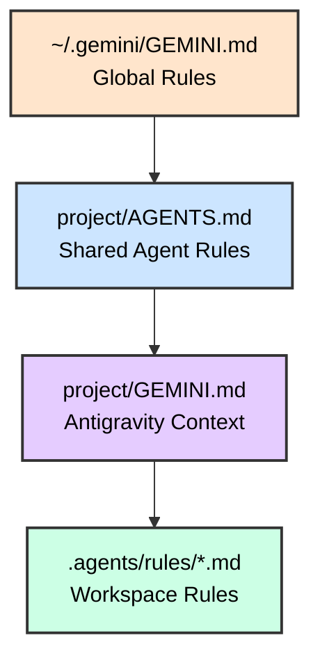

<style>
.slidev-page-num {
  display: block !important;
  opacity: 1 !important;
  visibility: visible !important;
  position: fixed !important;
  bottom: 1rem !important;
  right: 1rem !important;
  z-index: 100 !important;
  color: #666 !important;
  font-size: 0.875rem !important;
}
</style>

# Agentic Coding with Antigravity CLI

## Google's AI Agent in Your Terminal

<div class="pt-12">
  <span @click="$slidev.nav.next" class="px-2 py-1 rounded cursor-pointer" hover="bg-white bg-opacity-10">
    Press Space for next page <carbon:arrow-right class="inline"/>
  </span>
</div>

---

# Contact Info

Ken Kousen
Kousen IT, Inc.

- ken.kousen@kousenit.com
- http://www.kousenit.com
- http://kousenit.org (blog)
- Social Media:
  - [@kenkousen](https://twitter.com/kenkousen) (twitter)
  - [@kenkousen@foojay.social](https://foojay.social/@kenkousen) (mastodon)
  - [@kousenit.com](https://bsky.app/profile/kousenit.com) (bluesky)
- *Tales from the jar side* (free newsletter)
  - https://kenkousen.substack.com
  - https://youtube.com/@talesfromthejarside

---

# Course Overview

<v-clicks>

- **Duration**: 5 hours of hands-on learning
- **Format**: Instructor-led with multiple labs
- **Hands-on Labs**: Real codebases in Python, JavaScript, Java
- **Prerequisites**: Command-line experience, development background

</v-clicks>

---

# Topics Covered

<v-clicks>

- **Foundation**: Installation, CLI basics, authentication
- **Core Skills**: File operations, shell integration, context management
- **Customization**: `GEMINI.md`, `AGENTS.md`, rules, settings
- **Safety**: Sandbox mode, permission prompts, checkpointing
- **Advanced**: MCP integration, skills/plugins, session management

</v-clicks>

---

# The 2026 Transition

<v-clicks>

- Google is moving Gemini CLI users to **Antigravity CLI**
- Consumer/free/AI Pro/AI Ultra Gemini CLI requests stop **June 18, 2026**
- Enterprise Gemini Code Assist access is handled differently
- Antigravity CLI is **not** a 1:1 feature clone at launch
- Core constructs survive: context files, skills, hooks, subagents, MCP, plugins
- Command name changes from `gemini` to `agy`

</v-clicks>

---

# What is Antigravity CLI?

<v-clicks>

- Terminal-first surface for Google Antigravity agents
- Launched as the supported successor to Gemini CLI
- Built-in tools: file ops, shell, web/search capabilities
- Model Context Protocol (MCP) support
- Background and parallel subagent workflows
- Designed for developers who live in the terminal

</v-clicks>

---

# Key Differentiators

<v-clicks>

- **Unified Harness**: Shares Antigravity's agent platform
- **Terminal-First**: `agy` keeps agent work in your shell
- **Subagents**: Delegate work to background agent sessions
- **Configurable**: Permissions, keybindings, themes, settings
- **MCP / Skills / Plugins**: Extensible workflows

</v-clicks>

---

# Antigravity Surfaces

<v-clicks>

- **Antigravity**: agent-first desktop app for orchestration
- **Antigravity IDE**: developer IDE surface
- **Antigravity CLI**: terminal UI, launched with `agy`
- **Antigravity SDK**: preview path for custom agents
- The course focuses on **Antigravity CLI**

</v-clicks>

---

# Authentication

<v-clicks>

- Local use defaults to browser-based Google sign-in
- SSH sessions print a URL and authorization-code flow
- Enterprise use can connect Google Cloud projects
- Logout from the TUI with `/logout`
- First launch also asks for theme, rendering mode, and workspace trust

</v-clicks>

---

# Installation

<v-clicks>

- **macOS / Linux**: `curl -fsSL https://antigravity.google/cli/install.sh | bash`
- **Windows PowerShell**: `irm https://antigravity.google/cli/install.ps1 | iex`
- Installs the `agy` binary
- Verify: `agy --version`
- Start inside a trusted project directory

</v-clicks>

```bash
# Install on macOS / Linux
curl -fsSL https://antigravity.google/cli/install.sh | bash

# Verify installation
agy --version
```

---

# First Launch

<v-clicks>

- Open a project directory
- Run `agy`
- Pick visual theme and rendering mode
- Confirm workspace trust
- Complete Google sign-in

</v-clicks>

```bash
cd my-project
agy
```

---

# Basic Usage Modes

<v-clicks>

- **Interactive REPL**: `agy` - Start a conversation
- **One-shot**: `agy "prompt"` - Single response
- **Piped input**: `echo "task" | agy`
- **Interactive with context**: `agy -i "initial context"`

</v-clicks>

```bash
# Interactive mode
agy

# One-shot mode
agy "Explain what this codebase does"

# With initial context
agy -i "You are a Python expert"
```

---
layout: image-right
image: https://images.unsplash.com/photo-1555949963-ff9fe0c870eb?ixlib=rb-4.0.3&auto=format&fit=crop&w=1920&q=80
backgroundSize: cover
---

# Core Features

<div class="text-center mt-20">
  <h2 class="text-4xl font-bold text-white bg-black bg-opacity-60 px-6 py-3 rounded-lg">
    Essential Capabilities
  </h2>
  <p class="text-xl text-white bg-black bg-opacity-60 px-4 py-2 rounded mt-4">
    Master the fundamentals
  </p>
</div>

---

# File References with @

<v-clicks>

- Reference files directly: `@./src/main.js`
- Reference directories: `@./src/` (recursive)
- Reference images: `@./screenshot.png`
- Multiple references in one prompt

</v-clicks>

```bash
# Reference a specific file
agy "Explain @./src/app.py"

# Reference multiple files
agy "Compare @./old.js and @./new.js"

# Reference a directory
agy "Analyze the architecture in @./src/"
```

---

# Shell Integration with !

<v-clicks>

- Execute shell commands: `!git status`
- Toggle persistent shell mode: `!`
- Antigravity can observe and analyze output
- Combine with AI analysis

</v-clicks>

```bash
# In interactive mode:
> !npm test
# Antigravity sees the test output

> !git diff
# Ask Antigravity to analyze the changes

# Toggle persistent shell mode
> !
```

---

# Slash Commands: Navigation

<v-clicks>

- `/help` - Show available commands
- `/clear` - Clear conversation history
- `/config` - Open settings
- `/permissions` - Manage tool permissions

</v-clicks>

---

# Slash Commands: Workflow

<v-clicks>

- `/agents` - Open subagents panel
- `/fork` - Branch from an earlier point
- `/logout` - Remove saved credentials

</v-clicks>

---

# Slash Commands: Session Control

<v-clicks>

- `/resume` - Open session browser
- `/rewind` - Navigate and optionally revert history
- `/restore` - Recover from checkpoint

</v-clicks>

---

# Slash Commands in Action (Context)

```bash
# Open settings and permissions
/config
/permissions

# Inspect subagents
/agents

# Ask about active context
What context files and rules did you load?
```

---

# Slash Commands in Action (Sessions)

```bash
# Open session browser
/resume

# Rewind through recent interactions
/rewind

# Restore from checkpoint list
/restore
```

---

# Keyboard Shortcuts: Editing

<v-clicks>

- `Ctrl+L` - Clear screen
- `Ctrl+V` - Paste text/images
- `Ctrl+G` - Open external editor (was `Ctrl+X` before 0.37)

</v-clicks>

---

# Keyboard Shortcuts: Control

<v-clicks>

- Use the built-in help screen for current keybindings
- Treat auto-approval shortcuts as version-specific
- `Ctrl+C` - Cancel current operation
- `Ctrl+D` - Exit Antigravity CLI

</v-clicks>

---

# Built-in Tools

<v-clicks>

- **File System**: `read_file()`, `write_file()`, `replace()`, `glob()`
- **Shell**: Execute terminal commands
- **Web**: `google_web_search()`, `web_fetch()`
- **Memory**: `save_memory()` for cross-session recall

</v-clicks>

```bash
# Antigravity automatically uses appropriate tools
"Search the web for React 19 new features"
# Uses google_web_search()

"Read all Python files in src/"
# Uses glob() and read_file()

"Update the README with the changes we made"
# Uses write_file()
```

---
layout: image-right
image: https://images.unsplash.com/photo-1488590528505-98d2b5aba04b?ixlib=rb-4.0.3&auto=format&fit=crop&w=1920&q=80
backgroundSize: cover
---

# Safety & Control

<div class="mt-20">
  <h2 class="text-4xl font-bold text-white bg-black bg-opacity-60 px-6 py-3 rounded-lg">
    Work Safely
  </h2>
  <p class="text-xl text-white bg-black bg-opacity-60 px-4 py-2 rounded mt-4">
    Approval modes and sandboxing
  </p>
</div>

---

# Permissions

<v-clicks>

- Antigravity CLI prompts before sensitive tool use
- Use `/permissions` to review and adjust what agents may do
- Use `/config` or `/settings` for broader safety behavior
- `--sandbox` isolates execution where supported
- `--dangerously-skip-permissions` is for disposable demos only

</v-clicks>

```bash
agy

/permissions
/config
```

---

# Plan Mode

<v-clicks>

- Ask for a plan before approving file edits or commands
- Review the intended files, tests, and fallback path
- Open longer prompts in your external editor with `Ctrl+G`
- Use `/rewind` or `/undo` when the conversation drifts
- Use `/fork` to branch from a useful earlier point
- Great first step when exploring an unfamiliar codebase

</v-clicks>

```bash
Plan the change first. Do not edit files yet.
```

---

# Sandbox Mode

<v-clicks>

- Isolate file operations away from your host
- Multiple backends depending on your OS
- Prevents accidental system changes
- Perfect for exploring unfamiliar code

</v-clicks>

```bash
# Run in sandbox mode (picks the best backend for your OS)
agy --sandbox

# Short form
agy -s "Refactor this entire codebase"
```

---

# Sandbox Mode

<v-clicks>

- Use sandbox mode when letting agents run commands
- Combine with small, reviewable tasks
- Still inspect generated changes
- Sandbox behavior depends on platform support
- Good for unfamiliar repos, generated tests, and refactors

</v-clicks>

```bash
agy --sandbox
```

📖 [antigravity.google/docs/cli-settings](https://antigravity.google/docs/cli-settings)

---

# Checkpointing

<v-clicks>

- **Automatic**: Snapshots created before each file modification
- **Session History**: Resume and rewind are built into the TUI
- **Includes**: Files + conversation + tool call
- **Disabled by default**: Must enable in settings

</v-clicks>

```json
// ~/.gemini/antigravity-cli/settings.json
{ "general": { "checkpointing": { "enabled": true } } }
```

---

# Restoring Checkpoints

```bash
# List and select a checkpoint to restore
/restore

# Shows timestamps + filename + tool name
# e.g., 2025-06-22T10-00-00_000Z-app.py-write_file
```

Restores files AND resets conversation to that point

---
layout: image-left
image: https://images.unsplash.com/photo-1454165804606-c3d57bc86b40?ixlib=rb-4.0.3&auto=format&fit=crop&w=1920&q=80
backgroundSize: cover
---

# Context Management

<div class="text-center mt-20">
  <h2 class="text-4xl font-bold text-white bg-black bg-opacity-60 px-6 py-3 rounded-lg">
    Context Files and Rules
  </h2>
  <p class="text-xl text-white bg-black bg-opacity-60 px-4 py-2 rounded mt-4">
    Project memory and instructions
  </p>
</div>

---

# Context Files

<v-clicks>

- **Workspace context** loaded automatically
- **Coding standards** and conventions
- **Architecture context** for the AI
- **Persistent instructions** across sessions
- Antigravity CLI reads both `GEMINI.md` and `AGENTS.md`
- Workspace rules can also live under `.agents/rules/`

</v-clicks>

---

# Hierarchical Loading



Keep shared rules in `AGENTS.md`; use `GEMINI.md` only for Antigravity-specific context.

---

# Example AGENTS.md

```markdown
# Project: Weather API
## Tech Stack
- Backend: Python Flask
- Database: PostgreSQL
- Testing: pytest
## Coding Standards
- Use type hints for all functions
- Follow PEP 8 style guide
- Write docstrings for public APIs
## Current Focus
Implementing caching layer for API responses
```

---

# Context Commands

<v-clicks>

- `/config` - Manage settings
- `@` - Reference files and rules directly
- `/rewind` - Back out of context drift
- `/fork` - Branch from a useful earlier point
- Ask the agent what context it loaded

</v-clicks>

```bash
What project rules and context files are active right now?
```

---

# Modular Imports

<v-clicks>

- Import other files with `@file.md` syntax
- Break large context into components
- Supports relative and absolute paths

</v-clicks>

```markdown
# AGENTS.md

## Project Overview
@./docs/architecture.md

## Coding Standards
@./docs/style-guide.md

## API Documentation
@./docs/api-reference.md
```

---
layout: image-right
image: https://images.unsplash.com/photo-1558494949-ef010cbdcc31?ixlib=rb-4.0.3&auto=format&fit=crop&w=1920&q=80
backgroundSize: cover
---

# Configuration

<div class="mt-20">
  <h2 class="text-4xl font-bold text-white bg-black bg-opacity-60 px-6 py-3 rounded-lg">
    Customize Your Setup
  </h2>
  <p class="text-xl text-white bg-black bg-opacity-60 px-4 py-2 rounded mt-4">
    settings.json and environment
  </p>
</div>

---

# Configuration Files

<v-clicks>

1. **Settings** - `~/.gemini/antigravity-cli/settings.json`
2. **Keybindings** - `~/.gemini/antigravity-cli/keybindings.json`
3. **Global rules** - `~/.gemini/GEMINI.md`
4. **Workspace rules** - `.agents/rules/`
5. **Workspace skills** - `.agents/skills/`

</v-clicks>

---

# settings.json Options

```json
{
  "general": {
    "preferredEditor": "vscode",
    "vimMode": false,
    "checkpointing": { "enabled": true }
  }
}
```

---

# settings.json Options (UI + Tools)

```json
{
  "ui": {
    "hideTips": false,
    "hideBanner": false
  },
  "tools": {
    "sandbox": false
  }
}
```

---

# Tool Permissions

<v-clicks>

- Use `/permissions` for interactive permission management
- Use `/config` or `/settings` for persistent settings
- Keep high-risk commands behind prompts in teaching demos
- Prefer sandbox mode for generated shell work

</v-clicks>

```bash
/permissions
/config
```

📖 [antigravity.google/docs/cli-permissions](https://antigravity.google/docs/cli-permissions)

---

# File Filtering

<v-clicks>

- **respectGitIgnore**: Honor .gitignore patterns
- **enableRecursiveFileSearch**: Recursive completion
- **Rules**: Keep generated/sensitive paths out of agent context

</v-clicks>

```json
{
  "context": {
    "fileFiltering": {
      "respectGitIgnore": true,
      "enableRecursiveFileSearch": true
    }
  }
}
```

---

# Environment Variables

| Variable | Purpose |
|----------|---------|
| Browser sign-in | Default local authentication |
| `GOOGLE_API_KEY` | API-key route when supported |
| `GOOGLE_CLOUD_PROJECT` | GCP project for Vertex AI |
| `GOOGLE_CLOUD_LOCATION` | GCP region |
| `HTTP_PROXY` | Network proxy |

---

# Context File Strategy

<v-clicks>

- Use `AGENTS.md` for cross-tool repository rules
- Keep `GEMINI.md` for Antigravity/Gemini-specific context
- Put reusable workspace rules under `.agents/rules/`
- Put workspace skills under `.agents/skills/`

</v-clicks>

```text
project/
├── AGENTS.md
├── GEMINI.md
└── .agents/
    ├── rules/
    └── skills/
```

---
layout: image-right
image: https://images.unsplash.com/photo-1516321318423-f06f85e504b3?ixlib=rb-4.0.3&auto=format&fit=crop&w=1920&q=80
backgroundSize: cover
---

# Advanced Features

<div class="mt-20">
  <h2 class="text-4xl font-bold text-white bg-black bg-opacity-60 px-6 py-3 rounded-lg">
    Power User Tools
  </h2>
  <p class="text-xl text-white bg-black bg-opacity-60 px-4 py-2 rounded mt-4">
    MCP, Extensions, Sessions
  </p>
</div>

---

# Model Context Protocol (MCP)

<v-clicks>

- Standard protocol for AI-to-system connections
- Connect to external tools and services
- Supports local commands, HTTP, and SSE
- OAuth 2.0 for remote authentication

</v-clicks>

---

# MCP Configuration: Firecrawl

```json
{
  "mcpServers": {
    "firecrawl": {
      "command": "npx",
      "args": ["@modelcontextprotocol/server-firecrawl"],
      "env": {
        "FIRECRAWL_API_KEY": "${FIRECRAWL_API_KEY}"
      }
    }
  }
}
```

---

# MCP Configuration: Database

```json
{
  "mcpServers": {
    "postgres": {
      "command": "npx",
      "args": ["@modelcontextprotocol/server-postgres"],
      "env": {
        "CONNECTION_STRING": "${DATABASE_URL}"
      }
    }
  }
}
```

---

# Managing MCP Servers

```bash
# List configured MCP servers
agy mcp list

# Add a new MCP server
agy mcp add github npx -y @modelcontextprotocol/server-github

# Remove an MCP server
agy mcp remove github
```

---

# Managing MCP Auth/Refresh

```bash
# List MCP tools/resources from inside session
/mcp list

# Authenticate with OAuth-enabled MCP server
/mcp auth github

# Refresh MCP tools/resources
/mcp refresh
```

---

# MCP Server Options

<v-clicks>

- **command**: Shell command to start server
- **args**: Command arguments
- **env**: Environment variables
- **cwd**: Working directory

</v-clicks>

---

# MCP Server Options (Advanced)

<v-clicks>

- **timeout**: Startup timeout in ms
- **includeTools/excludeTools**: Filter available tools
- **trust**: Bypass tool confirmation for this server

</v-clicks>

---

# Popular MCP Servers

<v-clicks>

- **Firecrawl** - Web scraping, search, content extraction
- **PostgreSQL** - Database queries and schema
- **Filesystem** - Extended file operations
- **Slack** - Team communication
- **Playwright** - Browser automation

</v-clicks>

📖 **Registry**: [modelcontextprotocol.io/registry](https://modelcontextprotocol.io/registry)

---

# Plugins and MCP

<v-clicks>

- Antigravity CLI separates MCP server config from general settings
- Gemini CLI `settings.json` MCP entries migrate to `mcp_config.json`
- Some Gemini CLI extensions become Antigravity plugins
- Not every extension migrates 1:1

</v-clicks>

```bash
agy mcp list
```

📖 [antigravity.google/docs/gcli-migration](https://antigravity.google/docs/gcli-migration)

---

# A2A Remote Agents (0.33+)

<v-clicks>

- Antigravity CLI is built for multi-agent workflows
- Use `/agents` to open the agent panel
- Delegate background work to subagents
- Monitor status without blocking your terminal flow

</v-clicks>

---

# Extensions System

<v-clicks>

- Extend Antigravity with plugins and skills
- Global CLI skills live under `~/.gemini/antigravity-cli/skills/`
- Workspace skills live under `.agents/skills/`
- Reusable prompts belong in skills/workflows

</v-clicks>

```bash
/agents
/config
```

---

# Reusable Skills

<v-clicks>

- Skills package repeatable agent behavior
- Store workspace skills in `.agents/skills/<name>/SKILL.md`
- Keep descriptions specific so agents know when to use them
- Use skills for review, test generation, docs, refactoring

</v-clicks>

```markdown
---
name: code-review
description: Review code for issues.
---

Review code for:
- Security vulnerabilities
- Performance issues
- Best practices violations
```

---

# Session Management

<v-clicks>

- **Resume sessions**: Continue previous conversations
- **Auto-save resume**: CLI prints a resume command on exit
- **Session browser**: `/resume` from inside the TUI
- **Rewind**: `/rewind` or `/undo` backs out of drift

</v-clicks>

```bash
agy
/resume
/rewind
```

---

# Keybindings

<v-clicks>

- `/keybindings` opens the shortcut editor
- `Ctrl+G` opens your prompt in `$EDITOR`
- `Ctrl+D` exits the TUI
- `Ctrl+L` clears the screen
- `Ctrl+C` or `Esc` cancels/backs out

</v-clicks>

```bash
/keybindings
```

---

# IDE Integration

<v-clicks>

- **VS Code Integration**: Connect to workspace
- **Native diff viewing**: Review changes in editor
- **Context sharing**: IDE context available to Antigravity agents

</v-clicks>

```json
{
  "preferredEditor": "vscode"
}
```

---
layout: image-left
image: https://images.unsplash.com/photo-1498050108023-c5249f4df085?ixlib=rb-4.0.3&auto=format&fit=crop&w=1920&q=80
backgroundSize: cover
---

# Practical Applications

<div class="mt-20">
  <h2 class="text-4xl font-bold text-white bg-black bg-opacity-70 px-6 py-3 rounded-lg">
    Real-World Workflows
  </h2>
  <p class="text-xl text-white bg-black bg-opacity-70 px-4 py-2 rounded mt-4">
    Common use cases
  </p>
</div>

---

# Code Exploration

<v-clicks>

- Understand unfamiliar codebases
- Trace dependencies and data flow
- Find patterns and conventions
- Generate architecture documentation

</v-clicks>

```bash
agy "Analyze the architecture of @./src/ and explain
how the components interact"

agy "Trace the flow from the API endpoint to the database
in @./src/controllers/ and @./src/services/"
```

---

# Test Generation

<v-clicks>

- Generate unit tests for existing code
- Identify edge cases automatically
- Create integration test scaffolding
- Mock setup and fixtures

</v-clicks>

```bash
agy "Create comprehensive unit tests for @./src/utils.py
with pytest, including edge cases"

agy "Generate integration tests for @./src/api/users.py
with proper mocking"
```

---

# Documentation Generation

<v-clicks>

- README files for projects
- API documentation
- Architecture diagrams (Mermaid)
- Code comments and docstrings

</v-clicks>

```bash
agy "Generate a comprehensive README.md for this project"

agy "Add detailed docstrings to all public functions
in @./src/services/"

agy "Create a Mermaid diagram showing the system architecture"
```

---

# Refactoring & Modernization

<v-clicks>

- Upgrade legacy code patterns
- Apply modern language features
- Improve code organization
- Fix anti-patterns

</v-clicks>

```bash
agy "Refactor @./src/legacy.py to use modern Python 3.12
features like type hints and match statements"

agy "Convert this callback-based code to async/await
@./src/api.js"
```

---

# Debugging Workflows

<v-clicks>

- Analyze error messages and stack traces
- Identify root causes
- Suggest fixes with context
- Test and verify solutions

</v-clicks>

```bash
agy "This test is failing with @./tests/output.log.
Analyze the error and fix the issue in @./src/app.py"

agy "Debug why the API returns 500 errors.
Check @./src/routes.py and @./src/middleware.py"
```

---

# Git Workflows

<v-clicks>

- Generate commit messages
- Create pull request descriptions
- Analyze diffs and changes
- Resolve merge conflicts

</v-clicks>

```bash
# Analyze staged changes
!git diff --staged
"Generate a conventional commit message for these changes"

# Create PR description
"Create a pull request description summarizing the changes
from the last 5 commits"
```

---

# CI/CD Integration

<v-clicks>

- Use the CLI only where current `agy --help` confirms support
- Keep CI prompts deterministic and repo-scoped
- Store logs/artifacts for auditability
- Prefer human review for code-changing workflows

</v-clicks>

```bash
agy --help
agy "Review @./src/ for security issues"
```

---
layout: image-right
image: https://images.unsplash.com/photo-1522071820081-009f0129c71c?ixlib=rb-4.0.3&auto=format&fit=crop&w=1920&q=80
backgroundSize: cover
---

# Optional Advanced Module

<v-clicks>

- Designed for teams moving from personal usage to production workflows
- Can be taught live or assigned as follow-up practice
- Focus areas: auth strategy, governance, skills/MCP, CI automation

</v-clicks>

---

# Authentication Matrix (Team Use)

<v-clicks>

- **Login with Google**: Best default for local interactive usage
- **Browser sign-in**: Best default for local interactive usage
- **Google Cloud project**: Enterprise onboarding path
- **ADC / service account**: CI and controlled automation where supported
- **June 18, 2026**: Gemini CLI consumer transition deadline

</v-clicks>

---

# Auth Quick Checks

```bash
# Local route
agy

# Cloud route (ADC)
unset GOOGLE_API_KEY
gcloud auth application-default login
export GOOGLE_CLOUD_PROJECT="my-project"
export GOOGLE_CLOUD_LOCATION="us-central1"
agy
```

---

# Governance: Approval and Policies

<v-clicks>

- Approval mode controls are per-session safety rails
- Policies provide durable guardrails across users/projects
- Keep high-risk tools constrained in team settings
- Prefer explicit allow/deny patterns over ad-hoc approvals

</v-clicks>

---

# Governance: Hooks and Trust

<v-clicks>

- `/hooks list` shows active lifecycle hooks
- Use hooks for auditing, validation, and policy enforcement
- Folder trust impacts settings, skills, and context loading
- Treat untrusted repos with stricter modes and sandboxing

</v-clicks>

---

# Skills + MCP at Scale

<v-clicks>

- Skills package repeatable expert workflows for teams
- MCP connects external systems (docs, data, browsers, APIs)
- Resource URIs can be injected via `@server://resource/path`
- Use `includeTools`/`excludeTools` to narrow risky MCP exposure

</v-clicks>

---

# Skills + MCP Commands

```bash
# Skills lifecycle
/skills list
/skills disable skill-name
/skills enable skill-name

# MCP visibility and maintenance
/mcp list
/mcp auth server-name
/mcp refresh
```

---

# Automation Patterns (Non-Interactive)

<v-clicks>

- Verify current non-interactive flags with `agy --help`
- Use exit codes only after testing the exact command
- Keep prompts deterministic and repo-scoped
- Store logs/artifacts for auditability

</v-clicks>

---

# CI Example: Gate + Report

```bash
agy --help
agy "Review @./src/ for security issues and write a concise report"
```

---
layout: image-right
image: https://images.unsplash.com/photo-1522071820081-009f0129c71c?ixlib=rb-4.0.3&auto=format&fit=crop&w=1920&q=80
backgroundSize: cover
---

# Best Practices

<div class="text-center mt-20">
  <h2 class="text-4xl font-bold text-white bg-black bg-opacity-60 px-6 py-3 rounded-lg">
    Professional Workflows
  </h2>
  <p class="text-xl text-white bg-black bg-opacity-60 px-4 py-2 rounded mt-4">
    Tips for success
  </p>
</div>

---

# Effective Prompting

<v-clicks>

- **Be specific** about what you want to achieve
- **Provide context** about goals and constraints
- **Use file references** to ground the conversation
- **Iterate** for complex tasks
- **Include examples** when possible

</v-clicks>

---

# Safety Guidelines

<v-clicks>

- **Start in default mode** - Get comfortable first
- **Enable checkpointing** - Safety net for mistakes
- **Review generated code** - Don't blindly accept
- **Use sandbox** for exploratory work
- **Commit often** - Git is your safety net

</v-clicks>

---

# Project Setup

<v-clicks>

1. Create concise `AGENTS.md`
2. Add Antigravity-specific `GEMINI.md` only when needed
3. Configure relevant MCP servers
4. Create `.agents/skills/` for common workflows
5. Establish team conventions

</v-clicks>

---

# Context Best Practices

<v-clicks>

- **Keep it focused** - Relevant project info only
- **Update regularly** - Reflect current state
- **Prefer AGENTS.md** - Shared rules across tools
- **Include examples** - Show expected patterns
- **Document conventions** - Style guides, patterns

</v-clicks>

---

# Team Collaboration

<v-clicks>

- Share `AGENTS.md` in version control
- Document Antigravity settings for the team
- Create shared skills, rules, and workflows
- Document AI-assisted workflows
- Review AI-generated code together

</v-clicks>

---

# Common Pitfalls

<v-clicks>

- **Overly broad prompts** → Be specific
- **Missing context** → Use AGENTS.md or workspace rules
- **Skipping review** → Always verify output
- **Skipping permissions** → Only for disposable demos
- **Ignoring checkpoints** → Enable early

</v-clicks>

---

# Troubleshooting

<v-clicks>

- **Authentication issues**: Re-run browser sign-in or `/logout`
- **Rate limits**: Use appropriate tier
- **Tool failures**: Check MCP server status
- **Context not loading**: Ask which files/rules were loaded
- **CLI flags**: Use `agy --help` for the current reference

</v-clicks>

```bash
# Debug mode for troubleshooting
agy --help

# Inspect loaded context
What context files and rules did you load?

# Review active settings and permissions
/config
/permissions
```

---

# Quick Access

<div class="grid grid-cols-2 gap-8 mt-8 place-items-center">
  <div class="flex flex-col items-center">
    <h3>Antigravity CLI Docs</h3>
    <QRCode
      :width="200"
      :height="200"
      type="svg"
      data="https://antigravity.google/docs/cli-getting-started"
      :margin="5"
      :dotsOptions="{ type: 'rounded', color: '#3b82f6' }"
    />
    <p class="text-sm mt-2">antigravity.google/docs/cli-getting-started</p>
  </div>
  <div class="flex flex-col items-center">
    <h3>Course Repository</h3>
    <QRCode
      :width="200"
      :height="200"
      type="svg"
      data="https://github.com/kousen/gemini-training"
      :margin="5"
      :dotsOptions="{ type: 'rounded', color: '#10b981' }"
    />
    <p class="text-sm mt-2">github.com/kousen/gemini-training</p>
  </div>
</div>

---

# Important Links

<div class="mt-8 space-y-6 text-xl">

<v-clicks>

### 📚 Official Documentation
`https://antigravity.google/docs/cli-getting-started`

### 🔁 Migration Guide
`https://antigravity.google/docs/gcli-migration`

### 📦 MCP Server Registry
`https://modelcontextprotocol.io/registry`

### 💻 Course Materials
`https://github.com/kousen/gemini-training`

</v-clicks>

</div>

---

# Command Reference: Basic Usage

```bash
# Interactive mode
agy

# One-shot mode
agy "prompt"

# Interactive with initial context
agy -i "context"
```

---

# Command Reference: Safety

```bash
# Run in sandbox mode
agy --sandbox

# Disposable demo only
agy --dangerously-skip-permissions
```

---

# Command Reference: Sessions

```bash
agy
/resume
/rewind
```

---

# Command Reference: Output

```bash
agy --help
agy "prompt"
```

---

# Thank You!

<div class="text-center">

## Questions?

<div class="pt-12">
  <span class="text-6xl"><carbon:logo-github /></span>
</div>

**Kenneth Kousen**
*Author, Speaker, Java & AI Expert*

[kousenit.com](https://kousenit.com) | [@kenkousen](https://twitter.com/kenkousen)

</div>
